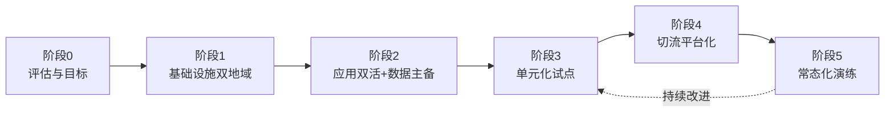
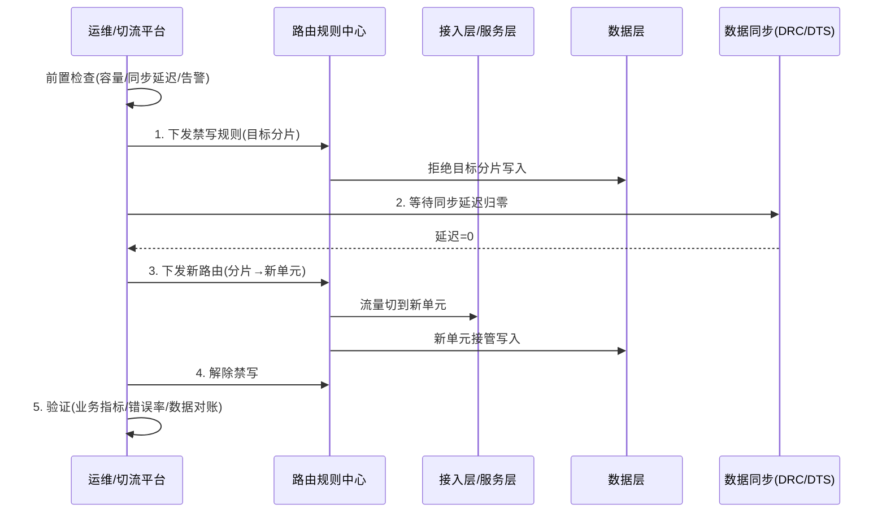

# 异地双活 + 容灾高可用设计要点

> 核心观点：异地双活的难点在**数据层和业务改造**，而不在 K8s 集群。集群可以用 GitOps 复制，有状态数据的跨地域同步受物理延迟和 CAP 约束。先定业务目标和数据策略，再选技术栈。
>
> 引用标注：`[n]` 对应文末「参考资料」。标注「通用实践」的内容为业界常见做法，未绑定单一出处。

---

## 0. 结论速览：做异地双活到底需要什么

| 能力 | 要解决的问题 | 业界代表做法 |
| --- | --- | --- |
| 业务单元化 | 同一份数据只在一个地方写，避免冲突 | 阿里按买家维度拆分 [1]；蚂蚁 LDC 按 uid 路由 [6]；饿了么按地理围栏拆分 [11][12]；AWS Cell-based [22] |
| 全链路路由 | 请求从入口到数据库都落在同一单元 | 接入层 / 服务层 / 数据层三层路由，DAL 拒绝错误单元的写入 [12] |
| 数据同步 | 跨地域复制、防回环、冲突处理 | 基于 binlog 的 DRC / Otter / Canal [11][16][17]；或 Paxos 多副本强一致 [8][10][27] |
| 全局数据处理 | 不可拆分的强一致数据 | 蚂蚁 GZone / CZone [6]；饿了么 GlobalZone（中心写、本地读）[12] |
| 切流管控 | 安全地把流量和写权限迁移到另一地 | 推送规则 → 禁写 → 等同步延迟归零 → 解除禁写 [4] |
| 仲裁与容量 | 防脑裂，切流后扛得住 | 2f+1 副本、跨故障域部署 [29]；预留容量做静态稳定 [24] |
| 常态化演练 | 证明能切、切得动 | Netflix Chaos Kong 区域撤离 [19][21]；阿里 MSHA 切流演练 [5]；监管要求年度演练 [14] |

没有一家是"所有数据随便多地写"。要么**按路由键拆分，每份数据只有一个写入点**；要么**用共识协议强一致，付出跨地域写延迟**。

---

## 1. 目标定义

### 1.1 RTO / RPO

| 指标 | 含义 | 影响 |
| --- | --- | --- |
| RTO | 故障后恢复服务所需时间 | 决定自动化程度、切换方式、热备/冷备 |
| RPO | 可容忍丢失的数据量（时间窗口） | RPO=0 且跨城，基本意味着同步复制或多数派写，写延迟显著上升 |

参考值：
- 银保监《商业银行业务连续性监管指引》要求重要业务 RTO ≤ 4 小时、RPO ≤ 0.5 小时 [15]。
- 阿里云 MSHA 公开的切流 RTO：内部平均 < 30s，客户侧约 1min [2]。
- 蚂蚁 LDC + OceanBase 三地五中心：RPO=0、RTO < 1min [6][8]。

### 1.2 容灾等级与演进路线

AWS 将云上容灾分为四档 [25]，与国内常用形态对应如下：

| 档位 | AWS 定义 [25] | 国内常见形态 | 数据 | 业务改造 | 典型 RTO / RPO |
| --- | --- | --- | --- | --- | --- |
| L1 | Backup & Restore | 异地冷备 | 定期备份 | 无 | 小时~天 / 小时 |
| L2 | Pilot Light | 异地温备（核心数据实时复制，计算按需拉起） | 异步复制 | 少 | 十分钟~小时 / 秒~分钟 |
| L3 | Warm Standby | 异地热备（完整环境缩容运行） | 异步复制 | 少 | 分钟 / 秒~分钟 |
| L4 | — | 同城双活 / 两地三中心 | 同城同步 + 异地异步 | 中 | 同城 ≈0，异地分钟级 |
| L5 | Multi-site Active/Active | 异地多活（单元化） | 异步复制 + 冲突控制，或 Paxos 多副本 | 大 | 分钟 / 秒级（Paxos 方案可 RPO=0） |

### 1.3 双活形态与延迟约束

| 形态 | 典型距离 / 延迟 | 数据复制方式 | 说明 |
| --- | --- | --- | --- |
| 同城双活 | 数十公里 [14]；TiDB DR Auto-Sync 要求 < 50km、< 1.5ms、> 10Gbps [54] | 同步 / 半同步 | 接近一个大集群 |
| 异地双活 / 多活 | 数百公里以上 [14]；北京–上海约 30ms [12] | 异步复制 | 需接受最终一致，或做单元化 |
| 应用双活 + 数据主备 | 不限 | 主备异步 | 最常见、性价比最高 |

物理延迟参考 [29]：数据中心内约 1ms，美国东西海岸约 45ms，纽约–伦敦约 70ms。MySQL 半同步每次提交至少多一个网络往返，官方说明它"适合距离近的服务器，最不适合远距离服务器"[50]。

### 1.4 故障域

需明确要防御的故障范围：

- [ ] 机房级
- [ ] 城市级
- [ ] 云厂商 region 级
- [ ] 软件缺陷与人为误操作（误删、错误配置全网推送）

> Google SRE 指出，软件缺陷和人为错误是任何副本放置方式都无法规避的故障域，必须另外保留备份 [29]。双活会把错误同步到两边，防不住这一类。

### 1.5 合规要求（金融行业）

- 《商业银行数据中心监管指引》（银监办发〔2010〕114号）[14]：
  - 第三条：同城模式一般相距数十公里，异地模式一般数百公里以上。
  - 第七条：总资产 ≥ 1000 亿且跨省设分支机构的银行、省级农信联社，须建异地模式灾备中心，灾难恢复能力 ≥ 5 级；其他银行须建同城灾备中心并做数据异地备份，能力 ≥ 4 级。
  - 第三十四条：每年至少一次专项切换演练，每三年至少一次全面切换演练。
- 灾难恢复等级依据 GB/T 20988。2025 版（推荐性标准）已发布，2026-01-01 实施，替代 2007 版 [13]。
- 说明："两地三中心"是大型银行满足上述要求的常见形态，监管文本本身并未使用这一表述 [14]。

---

## 2. 业界实践

### 2.1 阿里巴巴：从同城多机房到异地多活

- 来源：InfoQ 专访毕玄 [1]，阿里云 MSHA 文档 [2][3][4]。
- 演进：异地多活之前已有同城多机房。2009–2010 年尝试过异地冷备，后来放弃。约 2013 年因故决定做异地多活，内部称为"单元化"，三年规划：第二年做双活，第三年做多活 [1]。
- 2014 年双 11：两个城市各承担 50% 用户，按买家维度拆分，跨城数据同步延迟 < 1s，使用 DRC 同步 [1]。
- 产品化：能力沉淀为阿里云 MSHA，内部每年切流数千次，成功率 99.9%+ [2]。
- 切流流程：通过配置中心推送新路由规则 → 对迁移分片禁写 → 等待 DTS 同步延迟归零 → 解除禁写 [4]。

### 2.2 蚂蚁集团：LDC 单元化 + OceanBase

- 来源：尹博学《全分布式单元化技术架构》[6]，SOFAStack 文档 [7]，OceanBase 文档 [8][9]。
- 演进：单活 → 同城双活 → 两地三中心 → 单元化 [6]。
- 数据分区 [6][7]：

| Zone | 含义 | 部署 |
| --- | --- | --- |
| RZone | 可按 uid 拆分的数据和业务，单元内自包含 | 多个，每个负责一部分用户 |
| GZone | 不可拆分的全局数据 | 全局仅一份 |
| CZone | GZone 数据的只读副本，就近读 | 每个城市一份 |

- 路由示例：uid=68 → RZ03。网商银行在 2 个城市部署 4 个 RZone，每个承担 25% [6]。
- 数据层：OceanBase 三地五中心五副本，每个机房一个副本，每城最多 2 个。任意机房或任意整城故障后仍保有多数派，RPO=0 [8]。厂商公布的城市级故障恢复 < 1min [9]。

### 2.3 微信：PaxosStore

- 来源：VLDB 2017 论文 [10]。
- PaxosStore 是微信第二代存储，受 Megastore 启发，替换了 2011 年起使用的基于 NWR 的 QuorumKV。它采用无租约 Paxos，承载账号、联系人、消息、朋友圈、微信支付等业务 [10]。
- 路线：用共识协议做强一致多副本，不依赖异步复制加冲突合并。

### 2.4 饿了么：按地理位置分区

- 来源：陈永庭（DRC）[11]、虢国飞（GOPS 2017）[12] 的分享。
- 背景：多活改造前，全部业务在北京单机房，4000+ 台服务器。2017 年 4 月上海机房上线，北方用户走北京，南方用户走上海 [11][12]。
- 拆分维度：按用户、商家、骑手的地理围栏（POI）划分，映射到虚拟 ShardingKey。外卖业务天然具有地域性 [12]。
- 数据分类 [12]：
  - ShardingZone：本地读写。
  - GlobalZone：写集中在一个机房，读在本地完成。陈永庭的分享中称为 GlobalDB [11]。
- 保护：数据访问层（DAL）拒绝写入错误机房的请求 [12]。
- 同步：自研 DRC，做 MySQL 双向复制，目标延迟 < 1s，冲突按最新时间戳解决，400+ 条复制链路 [11]。
- 节奏：调研约 6 个月，落地约 3 个月 [12]。

### 2.5 Netflix：多 region Active-Active

- 来源：Netflix Tech Blog [18][19][20][21]。
- 2013 年：US-East-1 与 US-West-2 同时服务，geo-DNS 约 50/50 分流。服务无状态，请求路径上不做跨 region 调用，数据异步复制。Cassandra 测试中，一个 region 写入 100 万条记录，500ms 后另一 region 全部可读 [18]。
- 切流以 DNS 为主（Route53 / UltraDNS，用 Denominator 管理）。DNS 生效期间，Zuul 负责代理或重定向落到错误 region 的请求 [18]。
- 2016 年扩展到 3 个 region（加 EU-West-1）。错 region 请求改为 Zuul 到 Zuul 代理，一个 region 的流量可以撤离到另外两个 [20]。
- Chaos Kong：模拟整个 region 故障，做流量撤离，不真的下线基础设施 [19]。2015 年 US-East-1 的 DynamoDB 故障波及 20+ 项 AWS 服务、持续 6–8 小时，Netflix 只出现短暂抖动 [19]。
- Project Nimble：通过预置的"暗容量"（standby server group），region 撤离时间从约 50min 降到 8min。原先的 50min 中，决策约 5min、扩容 3–5min、服务启动约 25min、Zuul 代理 10+min、DNS 缓存过期约 5min [21]。

### 2.6 AWS：Cell-based 架构与静态稳定

- Cell-based [22]：bulkhead 模式的延伸。按分区键（如客户 ID）把负载划分到互不共享状态的 cell，路由层要做到"尽可能薄"。10 个 cell 中 1 个故障，90% 的请求不受影响。
- Shuffle sharding [23]：8 个 worker 固定分 4 组时，单组故障影响 25% 客户；改为每个客户随机分配 2 个 worker，共 28 种组合，单点故障影响降到 1/28。
- 静态稳定 [24]：预置足够容量，故障时不依赖控制面扩容。3 个 AZ 时多配 50%，每个 AZ 平时只跑到约 66%。
- 切换应依赖数据面操作（如 Route 53 ARC），避免依赖控制面 API [25]。
- 托管数据库的跨 region 复制：
  - DynamoDB Global Tables 默认 MREC 模式：异步复制，通常 1s 内完成，按 last-writer-wins 解决冲突，RPO 为秒级。MRSC 模式：写入至少同步到另一个 region，RPO=0，必须正好 3 个 region（或 2 个加见证），不支持事务 [26]。
  - Aurora Global Database：存储层复制，延迟通常 < 1s。计划内切换不丢数据，满足版本要求时 < 30s。托管故障转移 RTO 为分钟级、RPO 为秒级。旧主库的禁写只是尽力而为，存在脑裂风险 [30][31]。

### 2.7 Google：Spanner 与共识

- Spanner [27][28]：全球分布、同步复制的数据库。数据分为 split，每个 split 的副本组各自跑 Paxos 并选出 leader；写入需多数派投票副本确认。TrueTime 暴露时钟不确定性，用来实现外部一致性。
- 代价示例：从 us-east1 的只读副本做强一致读，要访问 europe-west4 的 leader，耗时约 100ms [28]。
- SRE 原则 [29]：容忍 f 个故障需要 2f+1 个副本，最少 3 个，推荐 5 个。副本放置是在可容忍的故障范围和延迟之间权衡。

---

## 3. 数据层（最关键）

### 3.1 数据分级

| 级别 | 示例 | 写入策略 | 对应业界概念 |
| --- | --- | --- | --- |
| 可拆分 | 用户订单、用户账户 | 按路由键分片，单元内写 | RZone [6] / ShardingZone [12] |
| 不可拆分、强一致 | 全局库存、全局配置 | 单点写，跨地域访问或本地只读副本 | GZone + CZone [6] / GlobalZone [12] |
| 可最终一致 | 日志、画像、缓存 | 可多地写，异步合并或各自重建 | 通用实践 |

### 3.2 单元化要点

- 选择路由键：userID、商户 ID、地理位置。要保证一次请求链路上的读写都落在同一单元 [1][6][12]。
- 单元之间不共享状态，路由层要尽量薄 [22]。
- 业务要接受：跨单元操作更慢，或只能最终一致。
- 容易拆的业务：电商买家侧、外卖、出行。难拆的业务：秒杀库存、全局账本（通用实践）。

### 3.3 中间件选型参考

| 组件 | 跨地域方案 | 注意事项 |
| --- | --- | --- |
| MySQL | 半同步（同城）[50]；异步主从（异地）；Canal / Otter / DTS 双向同步 [16][17] | 半同步默认 `AFTER_SYNC`，可做无损切换；超时（默认 10s）会退化为异步 [51]。双向同步须防回环、防冲突，Otter 内置回环控制 [17] |
| MySQL Group Replication | 单主或多主 | 最多 9 个成员，按稳定局域网测试；多主模式不支持 SERIALIZABLE 和级联外键 [52]。不建议跨城 |
| TiDB | 两地三中心 5 副本（2/2/1）[53]；同城 DR Auto-Sync [54]；TiCDC 跨地域复制，RPO 秒级、RTO 分钟级 [55] | 主城两个 AZ 同时故障时会短暂不可用，可能丢少量热数据 [53] |
| OceanBase | 三地五中心五副本，Paxos [8] | 每城最多 2 副本 |
| CockroachDB | REGION survival goal：至少 3 个 region，5 副本（2+2+1）[56] | 写延迟至少增加到最近 region 的 RTT [56] |
| Redis | Redis Enterprise Active-Active（CRDT）[57]；或不同步、各自重建 | 只复制数据，不复制配置和 Lua 脚本 [57]；注意缓存冷启动 |
| Kafka | MirrorMaker 2 [48][49] | 远端 topic 名带源集群前缀，用于检测循环，支持 active/active。消费位点需要翻译（checkpoint）。建议"从远端消费、写本地" [49] |
| Elasticsearch | CCR（leader / follower）[58] | follower 只读；follower 版本必须不低于 leader；安全配置、ILM、模板不会复制，删除索引不会同步；需要商业许可 [58] |

### 3.4 写冲突处理

- 主键：分段 ID，或在雪花 ID 中划出 region 位。Twitter Snowflake 为 41 位时间戳 + 10 位机器号 + 12 位序列号，跨数据中心生成无需协调，时钟回拨时拒绝生成 [59]。
- 冲突合并：最新时间戳（饿了么 DRC [11]），last-writer-wins（DynamoDB MREC [26]），版本号或 CRDT [57]。
- 根本手段是单元化，从源头避免两地写同一行。冲突合并只作兜底（通用实践）。
- 接口幂等，支持重放。

---

## 4. 脑裂与仲裁

- 两个站点无法自行判断"对方挂了"还是"网络断了"，**必须引入第三方仲裁站点（见证节点）**。容忍 f 个故障需要 2f+1 个副本 [29]。
- 共识系统部署为 3 地，或 2+1（第三地只放见证）。参考：Spanner witness 副本 [28]，DynamoDB MRSC 的 2 region + witness [26]，OceanBase 三地五中心 [8]。
- 切换策略：
  - 同城：可自动切换。
  - 异地：建议**半自动**（自动检测 + 人工确认），因为误切代价可能大于故障本身（通用实践）。
- 托管数据库的禁写也可能只是尽力而为（如 Aurora Global Database [31]）。切换流程中要在应用或路由层另做一次显式禁写。

---

## 5. 流量层

- 入口方案：GSLB / 智能 DNS、Anycast、云厂商全局负载均衡。
  - DNS 方案要关注 TTL 和客户端缓存。Netflix 的切换耗时中约 5min 用于等待 DNS 缓存过期 [21]。
  - DNS 生效期间，用网关代理落到错误站点的请求（Netflix Zuul [18][20]）。
- 健康检查要做到业务层面，只检查 TCP 端口不够。
- 容量规划：
  - 切流后目标站点必须扛住全部流量。两站点时，每边平时负载要 ≤ 50%（静态稳定的思路 [24]）。
  - 不要依赖故障时临时扩容。Netflix 用预置的暗容量把撤离时间从 50min 降到 8min [21]。

---

## 6. K8s 多集群层

| 关注点 | 方案 / 原则 |
| --- | --- |
| 集群拓扑 | 每地域一个独立集群。etcd 官方建议成员尽量部署在同一数据中心 [33]；K8s 官方多可用区指南只覆盖同一 region 内多 zone [34]。跨地域拉伸 etcd 需按 RTT 调大心跳和选举超时（心跳约 0.5–1.5×RTT，选举超时 ≥ 10×RTT）[32] |
| 应用分发 | Argo CD ApplicationSet（cluster generator 按标签选集群）[38]、Karmada [36]、OCM [37] |
| 集群级故障转移 | Karmada Failover：Beta，默认关闭；靠 NoExecute 污点触发迁移；有状态迁移需额外的 Alpha 特性门 [36] |
| 跨集群服务发现 | MCS API（ServiceExport / ServiceImport，`clusterset.local`）[35] |
| 跨集群网络 | Istio multi-primary 多网络，东西向网关前不能放 L7 LB [39]；Istio locality failover，需配合 outlier detection [40]；Cilium ClusterMesh，PodCIDR 不能重叠 [41]；Submariner，Globalnet 支持 CIDR 重叠 [42] |
| 配置与密钥 | GitOps + External Secrets Operator [45]。Vault 跨地域复制需要 Enterprise；performance secondary 的 token 独立，切换后应用要重新认证 [46] |
| 镜像仓库 | 每地域一个本地 Harbor，配置复制规则。Harbor 不支持不同版本之间复制 [47] |
| 备份 | Velero 定时备份，切换时把 BSL 设为 ReadOnly [43]；跨 region 迁移要用 File System Backup 或 CSI data mover，且不能恢复到更低的 K8s 版本 [44] |
| 控制面依赖 | DNS、IdP、CI/CD、监控必须能在单站点独立运行（通用实践） |

> 隐性依赖（只部署在一边的全局服务）经常导致"双活变单活"。

---

## 7. 详细方案流程

### 7.1 总体建设路线

多数团队停在阶段 2 就能满足要求（对应 L3/L4）。只有确实需要 L5 时才进入阶段 3。

### 7.2 阶段 0：评估与目标

| 步骤 | 产出 |
| --- | --- |
| 业务影响分析（BIA）：梳理业务清单、按重要性分级 | 业务分级表（核心 / 重要 / 一般） |
| 为每级业务定 RTO / RPO（金融业对照 [14][15]） | RTO / RPO 矩阵 |
| 确定防御的故障域（见 1.4） | 故障域清单 |
| 测量两地延迟与带宽 | 网络基线（RTT、抖动、带宽） |
| 选定目标档位 L1–L5（见 1.2） | 架构选型决策记录 |
| 估算成本：双倍容量、专线、改造人力 | 预算 |

### 7.3 阶段 1：基础设施双地域

1. 网络：两地专线（建议双运营商），可选第三地作为仲裁站点。
2. K8s：每地域一个独立集群，etcd 不跨地域 [33]。
3. GitOps：Argo CD ApplicationSet 让两边部署一致 [38]。
4. 镜像：每地 Harbor，配置复制 [47]。
5. 密钥：ESO + Vault，按地域部署 [45][46]。
6. 可观测：每地独立的监控告警 + 全局视图。重点指标包括复制延迟（如 MM2 的 `replication-latency-ms` [49]）。
7. 备份：Velero 定时备份 + 数据库快照，存到隔离的存储 [43]。
8. 依赖梳理：DNS、IdP、配置中心、注册中心、CI/CD 在两地都能独立运行。

验收：任一地域单独都能完成发布、登录、监控告警。

### 7.4 阶段 2：应用双活 + 数据主备

1. 应用无状态化：会话外置，本地文件改为对象存储。
2. 两地应用同时接流量，按比例分流（如 50/50），确保两边链路都长期有真实流量验证。
3. 数据库主在 A 地，B 地为从库：同城用半同步 `AFTER_SYNC` [51]，异地用异步复制或 TiCDC / Aurora Global 等 [30][55]。
4. B 地应用的写请求路由回 A 地主库，读请求可就近访问。
5. 中间件：Kafka 用 MM2 [48]，Redis 两地各自部署、各自预热，ES 用 CCR 或双写 [58]。
6. 定时任务、消息消费只在一边执行，或者加分布式锁。
7. 容量：每边按承担 100% 流量准备，平时负载 ≤ 50% [24]。

验收：完成一次计划内数据库主从切换演练，记录实际 RTO / RPO。

### 7.5 阶段 3：单元化改造（L5）

1. 选路由键：分析核心链路，找到能闭环的维度（uid / 商户 / 地理位置）[1][6][12]。
2. 数据分区：所有表归入 RZone（可拆分）/ GZone（全局写）/ CZone（全局只读副本）[6]。
3. 三层路由：
   - 接入层：网关按路由键转发到对应单元。
   - 服务层：RPC 和 MQ 感知单元，不跨单元调用。
   - 数据层：DAL 校验，拒绝写入错误单元 [12]。
4. 路由规则集中管理：维护"路由键区段 → 单元"的映射，推送到各层（MSHA 用配置中心推送 [4]）。
5. ID 生成：在 ID 中带上单元或地域位 [59]。
6. 数据同步：RZone 之间双向复制做兜底，打来源标记防回环 [11][17]；GZone 单向复制到各地，形成 CZone。
7. 试点：先选一两个核心业务，切 1%–5% 的用户到新单元，再逐步扩大（通用实践）。

验收：试点业务能按路由键区段在两单元间迁移，且无数据冲突。

### 7.6 阶段 4：切流 Runbook

#### 7.6.1 计划内切流（数据无损）

参考 MSHA 的切流流程 [4]：

| 步骤 | 操作 | 检查点 |
| --- | --- | --- |
| 0 前置检查 | 目标单元容量、同步延迟、近期变更、告警 | 目标单元负载 ≤ 50%；同步延迟 < 1s |
| 1 禁写 | 对要迁移的分片禁写 | 写请求返回可重试错误，不能静默丢弃 |
| 2 追平 | 等待同步延迟归零 | 延迟 = 0，位点一致 |
| 3 切路由 | 推送新路由规则 | 各层规则版本一致 |
| 4 解禁 | 新单元开始写入 | 写成功率恢复 |
| 5 验证 | 业务指标、错误率、数据对账 | 指标回到基线 |

禁写窗口就是用 RTO 换 RPO=0。窗口长度取决于同步延迟，所以平时就要把复制延迟压低。

#### 7.6.2 故障切流（源站点不可用）

源站点不可用时，无法禁写和等待追平，只能接受 RPO > 0（异步复制方案）：

1. 确认故障：自动检测 + 仲裁 + 人工确认，排除是自己这一侧网络隔离 [29]。
2. 隔离源站点：在路由层强制禁止流量和写入回到源站点，防止脑裂。托管数据库的禁写不可靠时要另做一层 [31]。
3. 记录同步位点：记下目标端最后收到的位点，作为后续对账的依据。
4. 提升目标端：数据库提升为主（Aurora 托管故障转移为分钟级 [31]；DynamoDB MRSC / OceanBase / TiDB 多数派方案可做到 RPO=0 [8][26][53]）。
5. 切流量：先切 DNS / GSLB，DNS 生效期间由网关代理残余流量 [18][21]。
6. 降级：关闭非核心功能，保住核心链路。
7. 观察：容量、错误率、慢查询、缓存命中率（防冷启动雪崩）。

#### 7.6.3 回切（故障恢复后）

1. 源站点恢复后**不要直接接流量**。先当作新的从库重建或追平数据（MySQL 官方要求故障后的旧主库丢弃重建，不要直接复用 [50]）。
2. 数据对账：比对故障时间窗口内两边的差异，未同步的数据走补偿或人工处理（通用实践）。
3. 按计划内切流流程（7.6.1）回切，先切小比例用户灰度，再逐步扩大。
4. 复盘：记录实际 RTO / RPO、问题清单、改进项。

### 7.7 阶段 5：常态化演练

| 演练类型 | 内容 | 频率建议 |
| --- | --- | --- |
| 组件级 | 单数据库主从切换、单中间件故障 | 每月 |
| 单元级 | 单个单元或分片的计划内切流 | 每月~每季度 |
| 站点级 | 整站点流量撤离（参考 Chaos Kong [19]） | 每季度~每半年 |
| 全面切换 | 真实切换并承载生产流量一段时间 | 每年；银行监管要求专项演练每年一次、全面演练每三年一次 [14] |
| 网络分区 | 断开两地专线，验证仲裁和防脑裂 | 每半年 |

演练记录实际 RTO / RPO，和目标对比后持续改进。MSHA 把切流演练做成平台功能 [5]，阿里内部每年切流数千次 [2]：切得越频繁，故障时越可靠。

---

## 8. 常见坑

- [ ] 数据库双向同步回环或冲突，导致数据悄悄不一致 [11][17]
- [ ] 全局单点（配置中心、注册中心、登录服务、证书签发）只部署在一边
- [ ] 切流时缓存冷启动、连接池打满，引发雪崩
- [ ] 平时流量比例悬殊（如 95/5），切换后另一边扛不住 [24]
- [ ] 故障时才扩容，扩容和服务启动耗时远超预期（Netflix 原流程中服务启动约 25min [21]）
- [ ] 定时任务、消息消费在两边重复执行（需分布式锁或单边调度）
- [ ] DNS TTL 和客户端缓存导致切流不彻底 [21]
- [ ] 托管数据库故障转移后旧主库仍可写，形成脑裂 [31]
- [ ] Kafka 切换后消费位点没有翻译，导致重复消费或丢消息 [48]
- [ ] 跨地域复制的组件有版本约束（Harbor、ES CCR、Cilium）没对齐 [41][47][58]
- [ ] 认为双活可以替代备份：误删和坏数据会同步到两边 [29]

---

## 9. 待确认信息

在进入具体架构设计前，需要明确：

| # | 问题 | 结论 |
| --- | --- | --- |
| 1 | 两地距离 / 网络延迟？自建 IDC 还是公有云？ | |
| 2 | 业务 RPO / RTO 要求？是否有强一致核心数据？是否受金融监管？ | |
| 3 | 现有技术栈：K8s 版本、数据库类型、是否有服务网格？ | |
| 4 | 目标档位（L1–L5）？"应用双活 + 数据主备"还是单元化多写？ | |
| 5 | 是否有天然的路由键（uid / 地域 / 租户）？ | |
| 6 | 是否有第三站点可用于仲裁？ | |
| 7 | 切换策略：自动 / 半自动 / 人工？ | |

---

## 参考资料

> 以下链接均于 2026-10 访问核实。部分站点直连受限，使用了 Web Archive 存档或镜像，已在条目中注明。

### 国内案例与标准

1. 专访阿里巴巴毕玄：异地多活数据中心项目的来龙去脉. InfoQ, 2015-04. https://www.infoq.cn/article/interview-alibaba-bixuan
2. 阿里云 MSHA：应用多活容灾架构建设管理. https://help.aliyun.com/zh/ahas/user-guide/why-is-msha-required
3. 阿里云 MSHA：多活容灾产品架构与组件. https://help.aliyun.com/zh/ahas/user-guide/architecture-of-msha
4. 阿里云 MSHA：异地双活切流任务的创建与执行. https://help.aliyun.com/zh/ahas/user-guide/traffic-switchover-for-remote-active-active-architecture
5. 阿里云 MSHA：创建并执行切流演练. https://help.aliyun.com/zh/ahas/user-guide/traffic-switchover-drill
6. 尹博学. 新一代金融核心突破之全分布式单元化技术架构. 阿里云开发者社区, 2020-07. https://developer.aliyun.com/article/767241
7. SOFAStack: How to Set Parameters Related to LDC Unitization. https://help.aliyun.com/en/document_detail/159837.html
8. OceanBase 高可用最佳实践. https://www.oceanbase.com/docs/common-best-practices-1000000001886772
9. OceanBase 异地多活解决方案（厂商资料）. https://www.oceanbase.com/solution/disaster-recovery
10. Lin et al. PaxosStore: High-availability Storage Made Practical in WeChat. PVLDB Vol.10, VLDB 2017. https://www.vldb.org/pvldb/vol10/p1730-lin.pdf
11. 陈永庭. 千万级日订单下，饿了么异地多活数据实施 DRC 的应用实践. 51CTO, 2017-08. https://k.sina.cn/article_1708729084_65d922fc034002boc.html （转载：https://www.cnblogs.com/davidwang456/articles/8241534.html ）
12. 虢国飞. 饿了么异地双活数据库实战（GOPS 2017 上海，转载）. https://www.cnblogs.com/DataArt/p/10006117.html
13. GB/T 20988-2025 网络安全技术 信息系统灾难恢复规范. https://openstd.samr.gov.cn/bzgk/std/newGbInfo?hcno=ABE370E7DABA83CD71BCAC2042A95F70
14. 《商业银行数据中心监管指引》（银监办发〔2010〕114号），第三方转载. https://www.66law.cn/tiaoli/73193.aspx
15. 《商业银行业务连续性监管指引》（银监发〔2011〕104号）. https://fgw.sh.gov.cn/ys-hqjrfw-1.3.1.2-h5/20240820/c1cca14a63624bb99c82608ea32ccc46.html
16. alibaba/canal. https://github.com/alibaba/canal
17. alibaba/otter 及 Wiki. https://github.com/alibaba/otter ， https://github.com/alibaba/otter/wiki/Introduction

### 海外案例

18. Netflix. Active-Active for Multi-Regional Resiliency, 2013-12（Web Archive）. https://web.archive.org/web/2016id_/http://techblog.netflix.com/2013/12/active-active-for-multi-regional.html
19. Netflix. Chaos Engineering Upgraded, 2015-09（Web Archive）. https://web.archive.org/web/2016id_/http://techblog.netflix.com/2015/09/chaos-engineering-upgraded.html
20. Netflix. Global Cloud – Active-Active and Beyond, 2016-03（Web Archive）. https://web.archive.org/web/2016id_/http://techblog.netflix.com/2016/03/global-cloud-active-active-and-beyond.html
21. Netflix. Project Nimble: Region Evacuation Reimagined（Web Archive）. https://web.archive.org/web/2018id_/https://medium.com/netflix-techblog/project-nimble-region-evacuation-reimagined-d0d0568254d4
22. AWS. Reducing the Scope of Impact with Cell-Based Architecture, 2023-09. https://docs.aws.amazon.com/wellarchitected/latest/reducing-scope-of-impact-with-cell-based-architecture/what-is-a-cell-based-architecture.html
23. AWS Builders' Library. Workload isolation using shuffle-sharding（Web Archive）. https://web.archive.org/web/2024id_/https://aws.amazon.com/builders-library/workload-isolation-using-shuffle-sharding/
24. AWS Builders' Library. Static stability using Availability Zones（Web Archive）. https://web.archive.org/web/2024id_/https://aws.amazon.com/builders-library/static-stability-using-availability-zones/
25. AWS. Disaster Recovery of Workloads on AWS: Disaster recovery options in the cloud. https://docs.aws.amazon.com/whitepapers/latest/disaster-recovery-workloads-on-aws/disaster-recovery-options-in-the-cloud.html
26. AWS. How DynamoDB global tables work. https://docs.aws.amazon.com/amazondynamodb/latest/developerguide/V2globaltables_HowItWorks.html
27. Corbett et al. Spanner: Google's Globally-Distributed Database. OSDI 2012. https://research.google/pubs/spanner-googles-globally-distributed-database-2/
28. Google Cloud. Spanner Replication. https://cloud.google.com/spanner/docs/replication
29. Google SRE Book, Ch.23 Managing Critical State: Distributed Consensus for Reliability. https://sre.google/sre-book/managing-critical-state/
30. AWS. Using Amazon Aurora Global Database. https://docs.aws.amazon.com/AmazonRDS/latest/AuroraUserGuide/aurora-global-database.html
31. AWS. Using switchover or failover in Amazon Aurora Global Database. https://docs.aws.amazon.com/AmazonRDS/latest/AuroraUserGuide/aurora-global-database-disaster-recovery.html

### K8s 与多集群

32. etcd Tuning. https://etcd.io/docs/v3.5/tuning/
33. etcd Hardware recommendations. https://etcd.io/docs/v3.5/op-guide/hardware/
34. Kubernetes. Running in multiple zones. https://kubernetes.io/docs/setup/best-practices/multiple-zones/
35. KEP-1645 Multi-Cluster Services API. https://github.com/kubernetes/enhancements/tree/master/keps/sig-multicluster/1645-multi-cluster-services-api
36. Karmada. Cluster Failover. https://karmada.io/docs/userguide/failover/cluster-failover
37. Open Cluster Management. https://open-cluster-management.io/
38. Argo CD ApplicationSet Cluster Generator. https://argo-cd.readthedocs.io/en/stable/operator-manual/applicationset/Generators-Cluster/
39. Istio. Install Multi-Primary on different networks. https://istio.io/latest/docs/setup/install/multicluster/multi-primary_multi-network/
40. Istio. Locality failover. https://istio.io/latest/docs/tasks/traffic-management/locality-load-balancing/failover/
41. Cilium. Setting up Cluster Mesh. https://docs.cilium.io/en/stable/network/clustermesh/setup/index.html
42. Submariner. https://submariner.io/
43. Velero. Disaster recovery. https://velero.io/docs/v1.18/disaster-case/
44. Velero. Cluster migration. https://velero.io/docs/main/migration-case/
45. External Secrets Operator. https://external-secrets.io/latest/
46. HashiCorp Vault. Replication support in Vault. https://developer.hashicorp.com/vault/docs/enterprise/replication
47. Harbor. Configuring Replication. https://goharbor.io/docs/main/administration/configuring-replication/

### 数据组件

48. KIP-382: MirrorMaker 2.0. https://cwiki.apache.org/confluence/display/KAFKA/KIP-382%3A+MirrorMaker+2.0
49. Apache Kafka. Geo-Replication (Cross-Cluster Data Mirroring). https://kafka.apache.org/43/operations/geo-replication-cross-cluster-data-mirroring/
50. MySQL 8.4. Semisynchronous Replication（Oracle 官方镜像）. https://docs.oracle.com/cd/E17952_01/mysql-8.4-en/replication-semisync.html
51. MySQL 8.4. Configuring Semisynchronous Replication. https://docs.oracle.com/cd/E17952_01/mysql-8.4-en/replication-semisync-interface.html
52. MySQL 8.4. Group Replication Limitations. https://docs.oracle.com/cd/E17952_01/mysql-8.4-en/group-replication-limitations.html
53. TiDB. Three Availability Zones in Two Regions Deployment. https://docs.pingcap.com/tidb/stable/three-data-centers-in-two-cities-deployment
54. TiDB. Two Availability Zones in One Region Deployment (DR Auto-Sync). https://docs.pingcap.com/tidb/stable/two-data-centers-in-one-city-deployment
55. TiDB. TiCDC Overview. https://docs.pingcap.com/tidb/stable/ticdc-overview
56. CockroachDB. Multi-Region Survival Goals. https://www.cockroachlabs.com/docs/stable/multiregion-survival-goals
57. Redis. Active-Active geo-distributed Redis. https://redis.io/docs/latest/operate/rs/databases/active-active/
58. Elastic. Cross-cluster replication. https://www.elastic.co/docs/deploy-manage/tools/cross-cluster-replication
59. twitter-archive/snowflake. https://github.com/twitter-archive/snowflake/tree/snowflake-2010
