# 基于 OpenTelemetry 的统一可观测平台架构设计

| 项目 | 内容 |
|---|---|
| 文档版本 | v0.2（草案）：新增 3.4 统一查询与关联设计、附录 A 业界调研 |
| 适用范围 | RKE2 1.28.x（CentOS 7.9）与 RKE2 1.35.x（SUSE）业务集群 |
| 信号范围 | Traces / Metrics / Logs |
| 文档状态 | 待评审，标注【待确认】的内容需补充现场信息 |

---

## 1. 背景与目标

### 1.1 现状

| 维度 | 现状 |
|---|---|
| K8s | RKE2 安装，1.28.2，≥3 个 control plane，后续新建 1.35.x 集群 |
| 平台 | KubeSphere 3.4.1 |
| 日志采集 | KubeSphere 管理的 Fluent Bit（DaemonSet） |
| 日志缓冲 | 已有 Kafka |
| 日志存储 | OpenSearch 2.6，保留 30 天 |
| 应用 | Spring Boot，JSON 日志，已集成 OTel SDK 但 trace_id 无效（业务自生成 UUID） |
| 环境 | 完全离线，私有 Harbor |

### 1.2 核心问题

1. 日志中的 trace_id 来自业务 UUID，与真实 Span 无关，三类信号无法关联。
2. 可观测能力绑定在 KubeSphere 3.4 上。KubeSphere 3.4 官方支持的 K8s 版本上限低于 1.28【待核实官方兼容矩阵】，且 4.x 不支持从 3.x 原地升级，1.35 上无法沿用现有日志栈。
3. 需要在 1.28 与 1.35 两个集群并存期间，日志系统持续可用。

### 1.3 设计目标

| 编号 | 目标 |
|---|---|
| G1 | Traces / Metrics / Logs 统一基于 OTel 采集，在 Grafana 中相互跳转：日志与 Trace 通过 trace_id，指标通过共享资源标签（见 3.4） |
| G2 | 采集链路与 KubeSphere 解耦，1.28 与 1.35 使用同一套 Helm Chart 和配置 |
| G3 | 存储后端部署在业务集群之外，集群升级、迁移、重建不影响数据 |
| G4 | Kafka 作为可选缓冲层，通过配置开关启用，应用与 Agent 无感 |
| G5 | 完全离线可部署、可升级，所有制品版本锁定 |
| G6 | 可观测平台故障时不影响业务（宁可丢数据，不可拖慢应用） |

### 1.4 非目标

- 本期不改造 MES / EAP / SECS-GEM 等遗留系统，仅预留接入点。
- 本期不做 K8s 集群升级本身，只保证采集链路在两个版本上可用。

---

## 2. 架构总览

### 2.1 系统上下文


<details><summary>Mermaid 源码</summary>

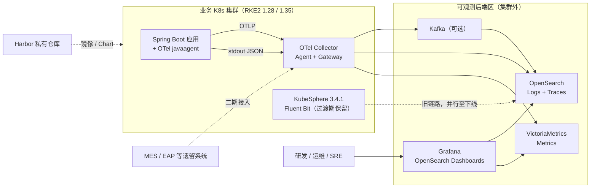
```mermaid
flowchart LR
    user["研发 / 运维 / SRE"]
    subgraph biz["业务 K8s 集群（RKE2 1.28 / 1.35）"]
        app["Spring Boot 应用<br/>+ OTel javaagent"]
        col["OTel Collector<br/>Agent + Gateway"]
        ks["KubeSphere 3.4.1<br/>Fluent Bit（过渡期保留）"]
    end
    subgraph obs["可观测后端区（集群外）"]
        kafka["Kafka（可选）"]
        os["OpenSearch<br/>Logs + Traces"]
        vm["VictoriaMetrics<br/>Metrics"]
        ui["Grafana<br/>OpenSearch Dashboards"]
    end
    harbor["Harbor 私有仓库"]
    legacy["MES / EAP 等遗留系统"]

    app -- "OTLP" --> col
    app -- "stdout JSON" --> col
    col --> kafka
    col --> os
    col --> vm
    kafka --> os
    ks -. "旧链路，并行至下线" .-> os
    user --> ui
    ui --> os
    ui --> vm
    harbor -. "镜像 / Chart" .-> biz
    legacy -. "二期接入" .-> col
```

</details>

### 2.2 关键架构决策（ADR 摘要）

| 编号 | 决策 | 理由 | 代价 |
|---|---|---|---|
| ADR-01 | 采集统一使用 OTel Collector（contrib 发行版），不再依赖 KubeSphere 的 fluentbit-operator | 与 KubeSphere 版本解耦；一个组件覆盖三类信号 | 需要自行维护 Collector 配置 |
| ADR-02 | 使用官方 `opentelemetry-collector` Helm Chart 部署，不引入 OTel Operator | 无 CRD、无 cert-manager 依赖，1.28/1.35 通用，离线镜像最少 | 放弃 Operator 的自动注入，javaagent 由基础镜像提供 |
| ADR-03 | 应用使用 OTel Java Agent，移除手动 SDK 初始化 | 避免两套 SDK 冲突，自动注入 MDC 的 trace_id | 需要统一基础镜像 |
| ADR-04 | 日志走 stdout + filelog，不走 OTLP 日志导出 | Collector 故障或升级时日志留在节点文件，恢复后断点续读 | 需要在 Collector 侧解析 JSON 与 trace_id |
| ADR-05 | Logs 与 Traces 存 OpenSearch，Metrics 存 VictoriaMetrics | OpenSearch exporter 的 metrics 处于 development 阶段；时序数据更适合 TSDB | 多维护一个存储组件；VM 不支持 exemplar，指标到 Trace 只能靠共享标签加时间窗（见 3.4、Q4） |
| ADR-06 | 后端部署在集群外（VM / 物理机） | 满足 G3，集群迁移不搬数据 | 需要单独的主机资源与运维 |
| ADR-07 | Kafka 为可选层，默认关闭 | 减少有状态组件；需要时只改 Gateway 配置 | 关闭时缓冲能力受限于 Gateway 持久化队列 |
| ADR-08 | 一期只做头部采样（SDK 端），不做尾部采样 | 尾部采样需要按 trace_id 路由，复杂度高 | 无法 100% 保留错误/慢请求，需要时二期引入；未采样请求的日志无法跳转到 Trace（见 3.4.4） |
| ADR-09 | Grafana 作为三类信号的统一查询入口，OpenSearch Dashboards 作为辅助 | 只有 Grafana 能同时查询 VM 与 OpenSearch，并通过 data link 与 Correlations 跳转 | Trace 到日志的跳转依赖 Correlations，需要实测；Grafana 与插件版本需成组锁定 |
| ADR-10 | OpenSearch 索引模板由 `backend/opensearch/` 预装，exporter 不管理模板 | exporter 的模板管理是 best-effort，失败时静默回退到动态映射，导致 Grafana 查询返回 0 条 | 模板需随 exporter 版本人工比对 |

---

## 3. 逻辑视图（Logical View）

关注系统提供哪些功能，以及功能模块如何划分。

### 3.1 分层逻辑架构


<details><summary>Mermaid 源码</summary>

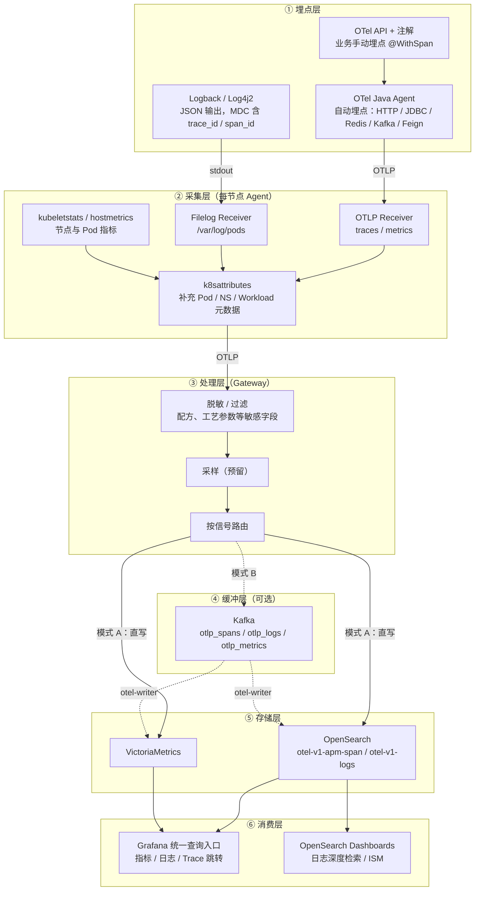
```mermaid
flowchart TB
    subgraph L1["① 埋点层"]
        api["OTel API + 注解<br/>业务手动埋点 @WithSpan"]
        ja["OTel Java Agent<br/>自动埋点：HTTP / JDBC / Redis / Kafka / Feign"]
        logfw["Logback / Log4j2<br/>JSON 输出，MDC 含 trace_id / span_id"]
    end
    subgraph L2["② 采集层（每节点 Agent）"]
        r_otlp["OTLP Receiver<br/>traces / metrics"]
        r_file["Filelog Receiver<br/>/var/log/pods"]
        r_host["kubeletstats / hostmetrics<br/>节点与 Pod 指标"]
        p_k8s["k8sattributes<br/>补充 Pod / NS / Workload 元数据"]
    end
    subgraph L3["③ 处理层（Gateway）"]
        p_red["脱敏 / 过滤<br/>配方、工艺参数等敏感字段"]
        p_samp["采样（预留）"]
        p_route["按信号路由"]
    end
    subgraph L4["④ 缓冲层（可选）"]
        kf["Kafka<br/>otlp_spans / otlp_logs / otlp_metrics"]
    end
    subgraph L5["⑤ 存储层"]
        st_os["OpenSearch<br/>otel-v1-apm-span / otel-v1-logs"]
        st_vm["VictoriaMetrics"]
    end
    subgraph L6["⑥ 消费层"]
        gf["Grafana 统一查询入口<br/>指标 / 日志 / Trace 跳转"]
        osd["OpenSearch Dashboards<br/>日志深度检索 / ISM"]
    end

    api --> ja
    ja -- "OTLP" --> r_otlp
    logfw -- "stdout" --> r_file
    r_otlp --> p_k8s
    r_file --> p_k8s
    r_host --> p_k8s
    p_k8s -- "OTLP" --> p_red --> p_samp --> p_route
    p_route -- "模式 A：直写" --> st_os
    p_route -- "模式 A：直写" --> st_vm
    p_route -. "模式 B" .-> kf
    kf -. "otel-writer" .-> st_os
    kf -. "otel-writer" .-> st_vm
    st_os --> gf
    st_vm --> gf
    st_os --> osd
```

</details>

### 3.2 信号关联模型

三类信号通过 Resource 属性和 trace_id 关联，这是排障时能互相跳转的基础。日志与 Trace 之间靠 trace_id 精确关联；指标与另外两类信号之间靠共享的资源标签加时间窗关联。


<details><summary>Mermaid 源码</summary>

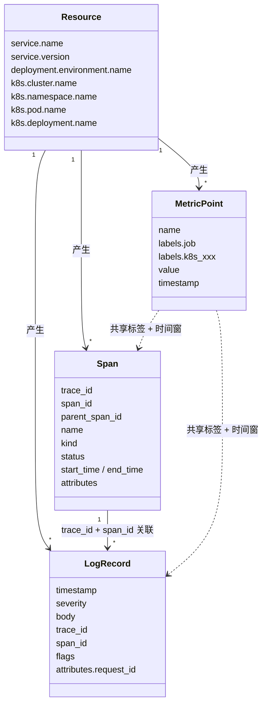
```mermaid
classDiagram
    class Resource {
        service.name
        service.version
        deployment.environment.name
        k8s.cluster.name
        k8s.namespace.name
        k8s.pod.name
        k8s.deployment.name
    }
    class Span {
        trace_id
        span_id
        parent_span_id
        name
        kind
        status
        start_time / end_time
        attributes
    }
    class LogRecord {
        timestamp
        severity
        body
        trace_id
        span_id
        flags
        attributes.request_id
    }
    class MetricPoint {
        name
        labels.job
        labels.k8s_xxx
        value
        timestamp
    }
    Resource "1" --> "*" Span : 产生
    Resource "1" --> "*" LogRecord : 产生
    Resource "1" --> "*" MetricPoint : 产生
    Span "1" --> "*" LogRecord : trace_id + span_id 关联
    MetricPoint ..> Span : 共享标签 + 时间窗
    MetricPoint ..> LogRecord : 共享标签 + 时间窗
```

</details>

说明：图中没有画 exemplar。exemplar 能把单个指标点直接关联到一条 Trace，但 Grafana 只对 Prometheus 类数据源支持 exemplar，VictoriaMetrics 也不支持，所以本方案不依赖它（见 3.4.2、Q4）。字段在各存储中的实际名称见 3.4.3。

### 3.3 关键字段规范

| 字段 | 来源 | 要求 |
|---|---|---|
| `service.name` | `OTEL_SERVICE_NAME` | 必填，与 Deployment 名称一致 |
| `k8s.cluster.name` | Collector resource processor | 必填，区分 1.28 / 1.35 集群 |
| `deployment.environment.name` | `OTEL_RESOURCE_ATTRIBUTES` | 必填：prod / uat / dev。旧名 `deployment.environment` 已在 semconv v1.27 弃用 |
| `trace_id` / `span_id` | Java Agent 写入 MDC | 日志中禁止再使用业务 UUID 命名为 traceId |
| `trace_flags` | Java Agent 写入 MDC | 日志模板必须输出，用于区分已采样 / 未采样（见 3.4.4） |
| `request_id` | 业务原 UUID 改名 | 可选，保留业务语义 |

各字段在 OpenSearch 和 VictoriaMetrics 中的实际名称见 3.4.3。

### 3.4 统一查询与关联设计

本节的"前端"指三类信号的统一查询界面，不涉及浏览器端 RUM。

#### 3.4.1 定位与分工

| 界面 | 角色 | 用途 |
|---|---|---|
| Grafana | 统一入口 | 指标大盘与告警；日志、Trace 检索（Explore）；信号之间的跳转 |
| OpenSearch Dashboards | 辅助工具 | 日志深度检索（Discover / PPL）；ISM、索引模板、角色权限管理；Trace Analytics 备用 |

选择 Grafana 作为入口有两个原因。一是只有 Grafana 能同时查询 VictoriaMetrics 和 OpenSearch。二是 OpenSearch 2.6 的 Trace Analytics 不能关联日志，这个能力从 2.15 才开始提供。

Grafana 有两种跳转机制：

- 大盘面板上的 data link，写在 dashboard JSON 中。
- Explore 中的 Correlations，写在数据源 provisioning 中。它只在 Explore 生效，显示位置是日志详情和表格单元格。

#### 3.4.2 关联跳转

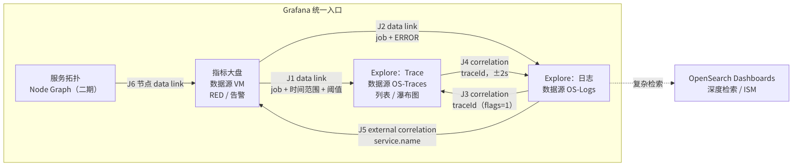

<details><summary>Mermaid 源码</summary>

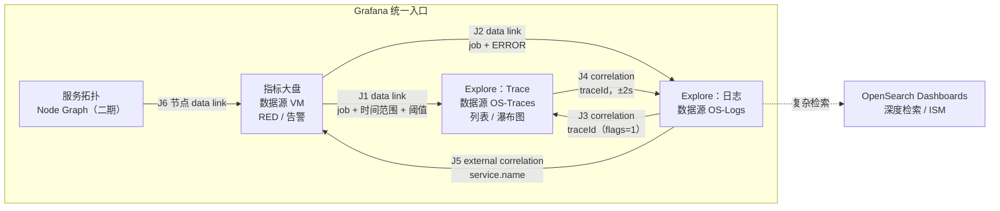
```mermaid
flowchart LR
    subgraph gf["Grafana 统一入口"]
        direction LR
        m["指标大盘<br/>数据源 VM<br/>RED / 告警"]
        t["Explore：Trace<br/>数据源 OS-Traces<br/>列表 / 瀑布图"]
        l["Explore：日志<br/>数据源 OS-Logs"]
        n["服务拓扑<br/>Node Graph（二期）"]
    end
    osd["OpenSearch Dashboards<br/>深度检索 / ISM"]

    m -- "J1 data link<br/>job + 时间范围 + 阈值" --> t
    m -- "J2 data link<br/>job + ERROR" --> l
    l -- "J3 correlation<br/>traceId（flags=1）" --> t
    t -- "J4 correlation<br/>traceId，±2s" --> l
    l -- "J5 external correlation<br/>service.name" --> m
    n -- "J6 节点 data link" --> m
    l -. "复杂检索" .-> osd
```

</details>

| 编号 | 方向 | 实现方式 | 关联条件 | 阶段 |
|---|---|---|---|---|
| J1 | 指标 → Trace | 面板 data link 打开 Explore，列出该服务的慢 Trace 或错误 Trace | `serviceName` 对应 `job` 标签；面板时间范围；耗时阈值或 `status.code:2` | 一期 |
| J2 | 指标 → 日志 | 面板 data link 打开 Explore，列出该服务的错误日志 | `resource.attributes.service.name` 对应 `job`；`severity.text` | 一期 |
| J3 | 日志 → Trace | 以 OS-Logs 为源、OS-Traces 为目标的 query correlation，目标查询为 Traces 类型；备选方案是 dataLinks 配合 Explore 相对 URL | `traceId` | 一期，需实测 |
| J4 | Trace → 日志 | 以 OS-Traces 为源的 query correlation，入口在 Trace 列表的 traceId 单元格；Grafana 12 的 trace correlations 可以在瀑布图上提供入口，但是否支持 OpenSearch 数据源需实测 | `traceId`，时间范围覆盖 span ±2s | 一期，需实测 |
| J5 | 日志 / Trace → 指标 | external correlation，打开服务 RED 大盘并带上 `var-service` | `service.name` | 一期 |
| J6 | 服务拓扑 | servicegraph connector 生成调用关系指标，在 Node Graph 面板展示，节点 data link 进入 RED 大盘 | `client` / `server` 标签 | 二期 |

说明：

- 插件自带的 dataLinks 在设置 `datasourceUid` 后生成内部链接，但只携带 `{query: url}`，不带 `luceneQueryType`，打不开 Traces 视图（依据插件源码推断）。因此 J3 首选 correlation。备选方案不设 `datasourceUid`，直接写 Explore 相对 URL。
- 插件把 OpenSearch 视为 trace 源时，不提供 Tempo 那样的 tracesToLogs 配置，所以 J4 只能通过 correlation 实现。
- Grafana 的 exemplar 只对 Prometheus 类数据源可用，而 VictoriaMetrics 不支持 exemplar。因此 J1 用共享标签加时间窗定位到候选 Trace 列表，不能从单个指标点直接跳到一条 Trace（见 Q4）。

#### 3.4.3 数据源与字段映射

| 数据源 | 类型 | UID | 目标 | 关键配置 |
|---|---|---|---|---|
| VM | `prometheus`（内置） | `vm` | VictoriaMetrics，经 vmauth 访问 | 不配置 exemplar |
| OS-Logs | `grafana-opensearch-datasource` | `os-logs` | `otel-v1-logs*` | timeField `@timestamp`，logMessageField `body`，logLevelField `severity.text` |
| OS-Traces | `grafana-opensearch-datasource` | `os-traces` | `otel-v1-apm-span*` | timeField `startTime`，查询类型 Lucene，模式 Traces |

插件的索引是按数据源配置的，所以日志和 Trace 分成两个数据源。两者都使用 OpenSearch 只读账号，只授予 `otel-v1-*` 的读权限。

同一个语义在三个存储中的字段名：

| 语义 | OTel 属性 | OpenSearch 日志 | OpenSearch Span | VictoriaMetrics 标签 |
|---|---|---|---|---|
| 服务 | `service.name` | `resource.attributes.service.name` | `serviceName` | `job` |
| 环境 | `deployment.environment.name` | `resource.attributes.deployment.environment.name` | 同左 | `deployment_environment_name` |
| 集群 | `k8s.cluster.name` | `resource.attributes.k8s.cluster.name` | 同左 | `k8s_cluster_name` |
| 命名空间 | `k8s.namespace.name` | `resource.attributes.k8s.namespace.name` | 同左 | `k8s_namespace_name` |
| Pod | `k8s.pod.name` | `resource.attributes.k8s.pod.name` | 同左 | `k8s_pod_name` |
| Trace | `trace_id`（MDC） | `traceId` | `traceId` | 无 |
| Span | `span_id`（MDC） | `spanId` | `spanId` | 无 |
| 采样标记 | `trace_flags`（MDC） | `flags`（1 表示已采样） | 无（写入的 Span 都是已采样的） | 无 |

规则：

- 不设置 `service.namespace`。设置后，prometheusremotewrite 生成的 `job` 会变成 `namespace/name`，J1 和 J2 就需要额外拆分。
- prometheusremotewrite 默认只把 `service.name` 和 `service.instance.id` 转成 `job` 和 `instance`，其他资源属性只放在 `target_info` 中。要按集群、命名空间筛选指标，需要开启 `resource_to_telemetry_conversion`，并在 metrics 流水线中先用白名单裁剪资源属性，控制基数：

```yaml
# Gateway metrics 流水线（示例，以 Helm values 为准）
processors:
  transform/metrics_labels:
    metric_statements:
      - context: resource
        statements:
          - keep_keys(attributes, ["service.name", "service.instance.id", "deployment.environment.name", "k8s.cluster.name", "k8s.namespace.name", "k8s.node.name", "k8s.pod.name", "k8s.container.name", "k8s.deployment.name", "host.name"])
exporters:
  prometheusremotewrite:
    endpoint: https://vm.obs.example.local:8428/api/v1/write
    resource_to_telemetry_conversion:
      enabled: true
```

#### 3.4.4 采样感知与时间窗

- 采样：javaagent 会在 MDC 中写入 `trace_id`、`span_id`、`trace_flags`。请求未被采样时 trace_id 仍然有效（`trace_flags=00`），日志带有 traceId，但 OpenSearch 中没有对应的 Span。处理方式：
  1. Agent 的 `trace_parser` 解析 `trace_flags`，写入 LogRecord.Flags，即 OpenSearch 的 `flags` 字段。
  2. Grafana 中预置"仅已采样日志"查询（`flags:1`）。J3 的链接标题写明"flags=1 时有效"。
  3. 低 QPS 服务使用 `parentbased_always_on` 全量采样。二期引入尾部采样，保留全部错误和慢请求。
  4. 可选增强：Agent 只给 flags=1 的日志写入 `attributes.sampled_trace_id`，J3 的 correlation 绑定在这个字段上，未采样的日志就不会出现跳转。Correlations 在变量为空时不生成链接，这一点可以利用。代价是每条日志多存一个字段。
- 时间窗：日志时间戳是应用写日志的时刻，与 span 起止时间之间存在时钟偏差（NTP 要求 < 100ms）和异步刷新延迟，所以 Trace → 日志的时间范围要覆盖 span 起止 ±2s。OpenSearch 数据源没有 Tempo 的 `spanStartTimeShift` 这类配置，correlation 跳转沿用源查询的时间范围。按 traceId 查询是精确匹配，只要源时间范围不比 span 起止 ±2s 更窄，就不会漏掉日志。

```yaml
# Agent filelog operators 片段
- type: trace_parser
  trace_id:
    parse_from: attributes.trace_id
  span_id:
    parse_from: attributes.span_id
  trace_flags:
    parse_from: attributes.trace_flags
```

#### 3.4.5 配置要点

索引模板：Grafana 的 Trace 查询依赖 keyword 类型的 `traceId`、`serviceName`、`traceGroup`，类型不对时查询会静默返回 0 条。exporter 的 `manage_index_template` 是 best-effort：失败只打 warn 日志，之后回退到动态映射；同名模板已存在时也不会覆盖。因此由 `backend/opensearch/` 预装索引模板，以 exporter 内置模板为基础，加入 ISM 和 rollover 设置，优先级高于 100。exporter 保持 `manage_index_template: false`。上线前检查映射：

```text
GET otel-v1-apm-span*/_mapping/field/traceId,spanId,serviceName,traceGroup
GET otel-v1-logs*/_mapping/field/traceId,spanId,@timestamp
```

数据源 provisioning：Grafana 会对 provisioning YAML 做环境变量替换，Grafana 自身的 `${...}` 变量要写成 `$${...}`。dashboard JSON 不做这种替换，写单个 `$` 即可。

```yaml
apiVersion: 1
prune: true
datasources:
  - name: VM
    uid: vm
    type: prometheus
    access: proxy
    url: https://vmauth.obs.example.local:8427
    editable: false
    version: 1                      # provisioning 版本，多副本时必须设置
    jsonData:
      httpMethod: POST
      timeInterval: 30s

  - name: OS-Logs
    uid: os-logs
    type: grafana-opensearch-datasource
    access: proxy
    url: https://opensearch.obs.example.local:9200
    basicAuth: true
    basicAuthUser: grafana_reader   # 只读角色
    secureJsonData:
      basicAuthPassword: $OS_GRAFANA_PASSWORD
    editable: false
    version: 1
    jsonData:
      flavor: opensearch
      version: "2.19.0"             # 与 OpenSearch 实际版本一致，升级后同步修改
      database: "otel-v1-logs*"
      timeField: "@timestamp"
      logMessageField: body
      logLevelField: severity.text
      pplEnabled: true
      maxConcurrentShardRequests: 5
      # J3 备选：不设 datasourceUid，用 Explore 相对 URL
      # dataLinks:
      #   - field: traceId
      #     title: 查看 Trace
      #     url: '/explore?schemaVersion=1&orgId=1&panes={"a":{"datasource":"os-traces","queries":[{"refId":"A","datasource":{"type":"grafana-opensearch-datasource","uid":"os-traces"},"queryType":"lucene","luceneQueryType":"Traces","query":"traceId:$${__value.raw}"}]}}'
    correlations:
      - targetUID: os-traces        # J3
        label: 查看 Trace（flags=1 时有效）
        type: query
        config:
          field: traceId
          target:                   # 以 Explore 中 Query inspector 显示的 query model 为准
            queryType: lucene
            luceneQueryType: Traces
            query: "traceId:$${traceId}"
      - targetUID: vm               # J5
        label: 服务 RED 大盘
        type: external
        config:
          field: resource.attributes.service.name
          transformations:
            - type: regex
              field: resource.attributes.service.name
              expression: "(.+)"
              mapValue: service
          target:
            url: "/d/svc-red/service-red?var-service=$${service}"   # 相对 URL 是否生效需实测，不行则改为 https://grafana.obs.example.local/d/...

  - name: OS-Traces
    uid: os-traces
    type: grafana-opensearch-datasource
    access: proxy
    url: https://opensearch.obs.example.local:9200
    basicAuth: true
    basicAuthUser: grafana_reader
    secureJsonData:
      basicAuthPassword: $OS_GRAFANA_PASSWORD
    editable: false
    version: 1
    jsonData:
      flavor: opensearch
      version: "2.19.0"
      database: "otel-v1-apm-span*"
      timeField: startTime
    correlations:
      - targetUID: os-logs          # J4
        label: 查看日志
        type: query
        config:
          field: traceId            # 以 Trace 列表实际列名为准
          target:
            queryType: lucene
            luceneQueryType: Logs
            query: 'traceId:"$${traceId}"'
```

J1 data link：在 RED 大盘的延迟面板上配置（填到界面里的原文如下）。`slow_ns` 是大盘变量，例如 2000000000，表示 2s。建议先在面板上框选告警时间段，再点击链接。

```text
/explore?schemaVersion=1&orgId=1&panes={"a":{"datasource":"os-traces","queries":[{"refId":"A","datasource":{"type":"grafana-opensearch-datasource","uid":"os-traces"},"queryType":"lucene","luceneQueryType":"Traces","query":"serviceName:\"${__field.labels.job}\" AND durationInNanos:>${slow_ns}"}],"range":{"from":"${__from}","to":"${__to}"}}}
```

查询错误 Trace 时，把 query 换成 `serviceName:\"${__field.labels.job}\" AND status.code:2`。这里不使用 `traceGroupFields.*` 过滤，因为它只写在根 span 上，而告警服务不一定是根服务。

J6 服务拓扑（二期）：servicegraph connector 要求同一条 Trace 的所有 Span 进入同一个 Collector 实例。二期把 Agent 的 traces 流水线改为 loadbalancing exporter（`routing_key: traceID`，通过 headless Service 解析 Gateway Pod），尾部采样复用这套路由。Node Graph 面板只需要 edges 数据帧，节点由 Grafana 自动推导：

```text
# 查询：Instant，Format = Table，refId = edges
label_join(sum by (client, server) (rate(traces_service_graph_request_total[5m])), "id", "->", "client", "server")
# Transform → Organize fields：client→source，server→target，Value→mainstat
```

#### 3.4.6 关联质量监控

关联失败时要让用户看得到。以下面板放在平台自监控大盘中：

| 指标 | 计算方式 | 异常说明 |
|---|---|---|
| traceId 覆盖率 | 按服务统计 `_exists_:traceId` 的日志数占总日志数的比例 | 应用未挂 javaagent，或日志模板未输出 MDC |
| 已采样日志断链率 | 定时抽样 `flags:1` 日志的 traceId，统计在 `otel-v1-apm-span*` 中查不到 Span 的比例 | Gateway 丢弃、索引写入失败、模板错误 |
| 导出失败 | `otelcol_exporter_send_failed_*`（见第 9 节） | 后端不可用或背压 |

#### 3.4.7 离线插件与版本锁定

1. 外网区按 5.4 锁定的版本下载 Grafana 和插件 zip（插件按 OS / 架构分包），纳入 5.3 的 SHA256 清单。
2. 内网把插件解压到 `/var/lib/grafana/plugins/<plugin-id>/`，或者执行 `grafana cli --pluginUrl <zip> plugins install <plugin-id>`。容器化部署时，把插件打进自建 Grafana 镜像。
3. 在 `grafana.ini` 的 `[plugins]` 中设置 `preinstall_disabled = true`，避免启动时联网安装预置插件。`GF_PLUGINS_INSTALL` 从 12.1 起已弃用，不要使用。
4. Grafana 两个副本共用外部 PostgreSQL / MySQL。数据源、关联、大盘全部通过 provisioning 管理，并设 `editable: false`。
5. 升级时，Grafana 和两个插件作为一组先在测试环境升级，回归 AC-7 之后再上生产。

---

## 4. 进程视图（Process View）

关注运行时的进程、并发、数据流以及故障处理。

### 4.1 Agent（DaemonSet）内部流水线


<details><summary>Mermaid 源码</summary>

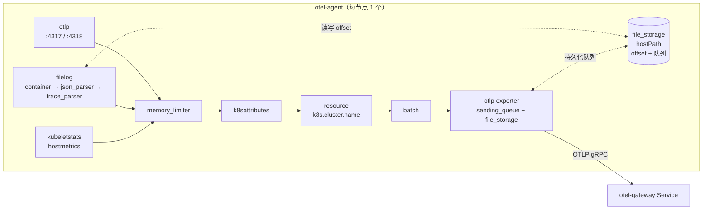
```mermaid
flowchart LR
    subgraph agent["otel-agent（每节点 1 个）"]
        direction LR
        rx1["otlp<br/>:4317 / :4318"]
        rx2["filelog<br/>container → json_parser → trace_parser"]
        rx3["kubeletstats<br/>hostmetrics"]
        ml["memory_limiter"]
        k8s["k8sattributes"]
        res["resource<br/>k8s.cluster.name"]
        bt["batch"]
        ex["otlp exporter<br/>sending_queue + file_storage"]
        fs[("file_storage<br/>hostPath<br/>offset + 队列")]

        rx1 --> ml
        rx2 --> ml
        rx3 --> ml
        ml --> k8s --> res --> bt --> ex
        rx2 <-. "读写 offset" .-> fs
        ex <-. "持久化队列" .-> fs
    end
    ex -- "OTLP gRPC" --> gw["otel-gateway Service"]
```

</details>

### 4.2 Gateway 内部流水线（模式 A / 模式 B）


<details><summary>Mermaid 源码</summary>

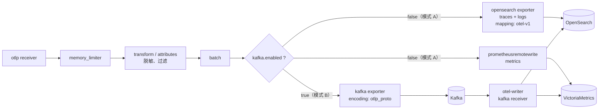
```mermaid
flowchart LR
    in["otlp receiver"] --> ml["memory_limiter"] --> tf["transform / attributes<br/>脱敏、过滤"] --> bt["batch"]

    bt --> sw{"kafka.enabled ?"}
    sw -- "false（模式 A）" --> e1["opensearch exporter<br/>traces + logs<br/>mapping: otel-v1"]
    sw -- "false（模式 A）" --> e2["prometheusremotewrite<br/>metrics"]
    sw -- "true（模式 B）" --> e3["kafka exporter<br/>encoding: otlp_proto"]

    e1 --> os[("OpenSearch")]
    e2 --> vm[("VictoriaMetrics")]
    e3 --> kf[("Kafka")]
    kf --> wr["otel-writer<br/>kafka receiver"]
    wr --> os
    wr --> vm
```

</details>

说明：图中的判断节点表示部署时的配置开关（两套 values 文件），不是运行时动态分支。

### 4.3 一次请求的 Trace 与 Log 关联时序


<details><summary>Mermaid 源码</summary>

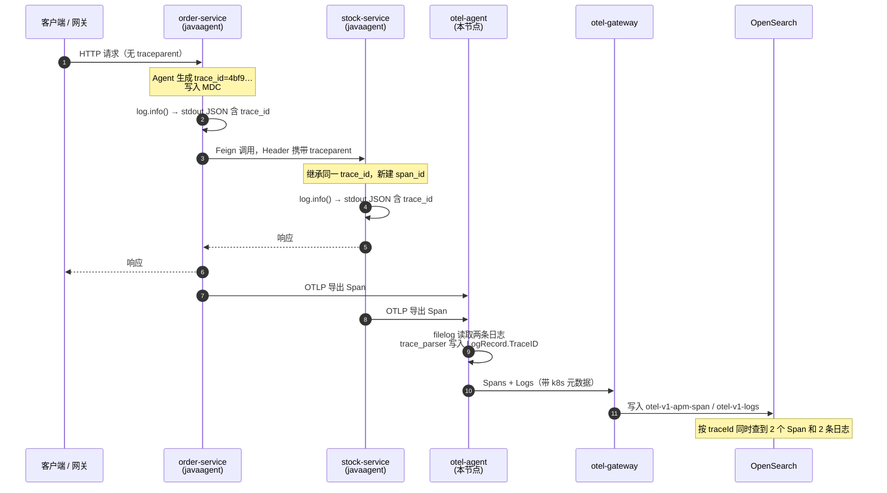
```mermaid
sequenceDiagram
    autonumber
    participant C as 客户端 / 网关
    participant A as order-service<br/>(javaagent)
    participant B as stock-service<br/>(javaagent)
    participant AG as otel-agent<br/>(本节点)
    participant GW as otel-gateway
    participant OS as OpenSearch

    C->>A: HTTP 请求（无 traceparent）
    Note over A: Agent 生成 trace_id=4bf9…<br/>写入 MDC
    A->>A: log.info() → stdout JSON 含 trace_id
    A->>B: Feign 调用，Header 携带 traceparent
    Note over B: 继承同一 trace_id，新建 span_id
    B->>B: log.info() → stdout JSON 含 trace_id
    B-->>A: 响应
    A-->>C: 响应
    A->>AG: OTLP 导出 Span
    B->>AG: OTLP 导出 Span
    AG->>AG: filelog 读取两条日志<br/>trace_parser 写入 LogRecord.TraceID
    AG->>GW: Spans + Logs（带 k8s 元数据）
    GW->>OS: 写入 otel-v1-apm-span / otel-v1-logs
    Note over OS: 按 traceId 同时查到 2 个 Span 和 2 条日志
```

</details>

### 4.4 后端故障与背压处理


<details><summary>Mermaid 源码</summary>

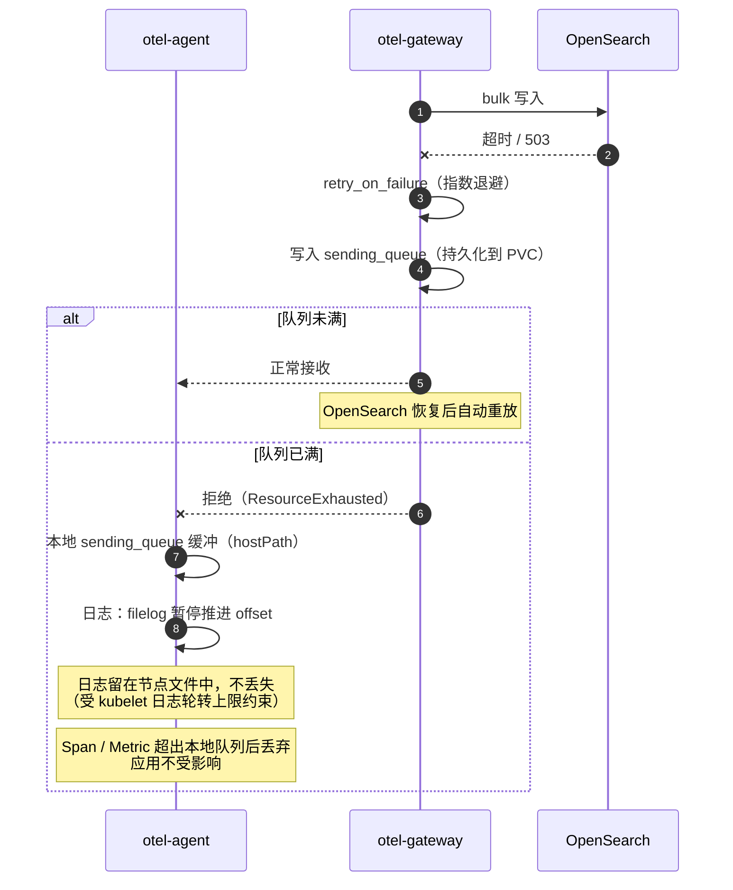
```mermaid
sequenceDiagram
    autonumber
    participant AG as otel-agent
    participant GW as otel-gateway
    participant OS as OpenSearch

    GW->>OS: bulk 写入
    OS--xGW: 超时 / 503
    GW->>GW: retry_on_failure（指数退避）
    GW->>GW: 写入 sending_queue（持久化到 PVC）
    alt 队列未满
        GW-->>AG: 正常接收
        Note over GW: OpenSearch 恢复后自动重放
    else 队列已满
        GW--xAG: 拒绝（ResourceExhausted）
        AG->>AG: 本地 sending_queue 缓冲（hostPath）
        AG->>AG: 日志：filelog 暂停推进 offset
        Note over AG: 日志留在节点文件中，不丢失<br/>（受 kubelet 日志轮转上限约束）
        Note over AG: Span / Metric 超出本地队列后丢弃<br/>应用不受影响
    end
```

</details>

### 4.5 运行时组件清单

| 组件 | 形态 | 副本 | 状态 | 关键配置 |
|---|---|---|---|---|
| otel-agent | DaemonSet | 每节点 1 | hostPath 存 offset 与队列 | `memory_limiter`、`file_storage` |
| otel-gateway | Deployment | 3 + PDB(minAvailable 2) | PVC 持久化队列 | HPA 可选 |
| otel-cluster | Deployment | 1 | 无 | `k8s_cluster`、`k8sobjects`（事件） |
| otel-writer（模式 B） | systemd 二进制，部署于后端区 | 2–3 | 无（offset 在 Kafka） | 同一 consumer group |

---

## 5. 开发视图（Development View）

关注代码、配置、制品的组织和交付方式。

### 5.1 制品与仓库结构

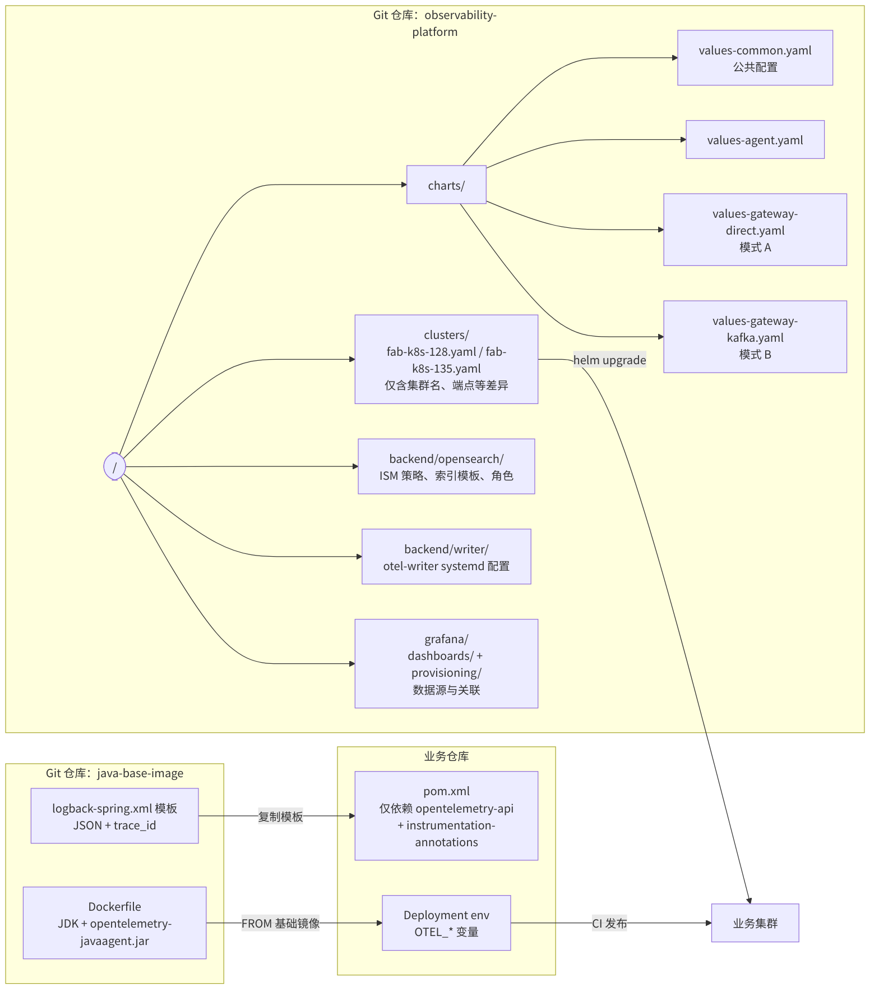

<details><summary>Mermaid 源码</summary>

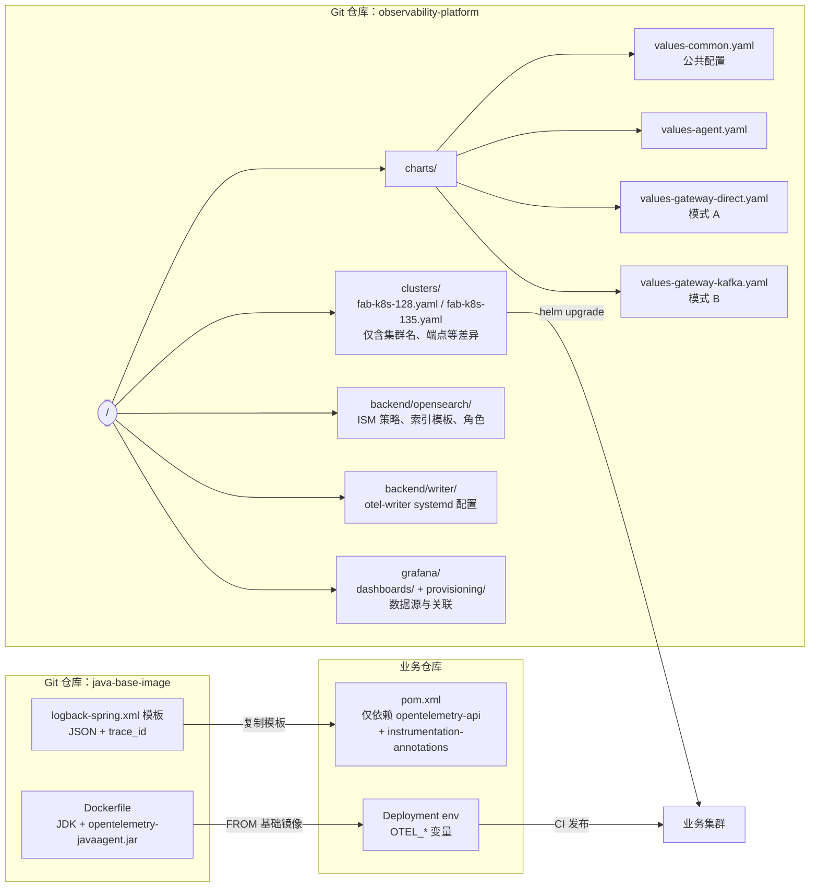
```mermaid
flowchart LR
    subgraph repo["Git 仓库：observability-platform"]
        r0(["/"])
        c0["charts/"]
        c1["values-common.yaml<br/>公共配置"]
        c2["values-agent.yaml"]
        c3["values-gateway-direct.yaml<br/>模式 A"]
        c4["values-gateway-kafka.yaml<br/>模式 B"]
        c5["clusters/<br/>fab-k8s-128.yaml / fab-k8s-135.yaml<br/>仅含集群名、端点等差异"]
        c6["backend/opensearch/<br/>ISM 策略、索引模板、角色"]
        c7["backend/writer/<br/>otel-writer systemd 配置"]
        c8["grafana/<br/>dashboards/ + provisioning/<br/>数据源与关联"]
        r0 --> c0
        c0 --> c1 & c2 & c3 & c4
        r0 --> c5 & c6 & c7 & c8
    end
    subgraph base["Git 仓库：java-base-image"]
        b1["Dockerfile<br/>JDK + opentelemetry-javaagent.jar"]
        b2["logback-spring.xml 模板<br/>JSON + trace_id"]
    end
    subgraph appRepo["业务仓库"]
        a1["pom.xml<br/>仅依赖 opentelemetry-api<br/>+ instrumentation-annotations"]
        a2["Deployment env<br/>OTEL_* 变量"]
    end
    k8s["业务集群"]
    b1 -- "FROM 基础镜像" --> a2
    b2 -- "复制模板" --> a1
    c5 -- "helm upgrade" --> k8s
    a2 -- "CI 发布" --> k8s
```

</details>

### 5.2 Java 应用改造规范

| 类别 | 规则 |
|---|---|
| 必须移除 | `opentelemetry-sdk*`、`opentelemetry-spring-boot-starter`（与 Agent 冲突）、Spring Cloud Sleuth、`micrometer-tracing-bridge-*` |
| 允许保留 | `opentelemetry-api`、`opentelemetry-instrumentation-annotations` |
| 日志 | 使用基础镜像提供的 `logback-spring.xml`；pattern 模式使用 `%X{trace_id}`；logstash-logback-encoder 默认输出 MDC |
| 业务 UUID | 改名为 `request_id`，不得命名为 `traceId` / `trace_id` |
| 手动埋点 | 关键业务方法使用 `@WithSpan`；属性中禁止写入配方、工艺参数、良率 |
| 配置 | 统一通过环境变量注入，禁止在代码中硬编码 Collector 地址 |

### 5.3 离线制品交付流水线


<details><summary>Mermaid 源码</summary>

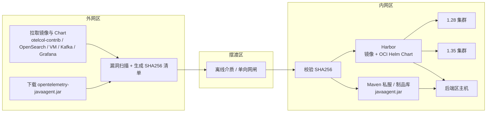
```mermaid
flowchart LR
    subgraph inet["外网区"]
        s1["拉取镜像与 Chart<br/>otelcol-contrib / OpenSearch / VM / Kafka / Grafana"]
        s2["下载 opentelemetry-javaagent.jar"]
        s3["漏洞扫描 + 生成 SHA256 清单"]
    end
    subgraph ferry["摆渡区"]
        f1["离线介质 / 单向网闸"]
    end
    subgraph intra["内网区"]
        h1["Harbor<br/>镜像 + OCI Helm Chart"]
        h2["Maven 私服 / 制品库<br/>javaagent.jar"]
        h3["校验 SHA256"]
        d1["1.28 集群"]
        d2["1.35 集群"]
        d3["后端区主机"]
    end
    s1 --> s3
    s2 --> s3
    s3 --> f1 --> h3
    h3 --> h1
    h3 --> h2
    h1 --> d1
    h1 --> d2
    h2 --> d3
    h1 --> d3
```

</details>

### 5.4 版本基线【待锁定】

| 组件 | 基线策略 |
|---|---|
| otelcol-contrib | 锁定一个具体小版本，1.28 / 1.35 使用同一版本；升级前在测试集群验证 opensearch / kafka exporter 配置字段 |
| opentelemetry-collector Helm Chart | 与 Collector 版本对应锁定 |
| OTel Java Agent | 锁定 2.x 具体版本，随基础镜像发布 |
| OpenSearch | 由 2.6 升级至 2.19.x 或 3.x（独立部署，见 Q9）；Grafana 数据源 `jsonData.version` 同步修改 |
| VictoriaMetrics | 锁定具体版本，单机版起步 |
| Grafana | 锁定 12.x 具体版本；12.0 起 trace correlations GA，11.3 起 external correlation GA |
| grafana-opensearch-datasource | 锁定 2.34.x，要求 Grafana ≥ 10.4.0；不低于 2.31.1（修复 OpenSearch 作为 trace-to-logs 目标的问题） |
| victoriametrics-metrics-datasource | 可选，0.26.1；默认使用内置 prometheus 数据源，启用前核对插件声明的 Grafana 版本约束 |
| Kafka | 复用现有集群或新建 KRaft 模式集群 |

---

## 6. 物理视图（Physical View）

关注部署拓扑、网络分区、主机与端口。

### 6.1 部署拓扑

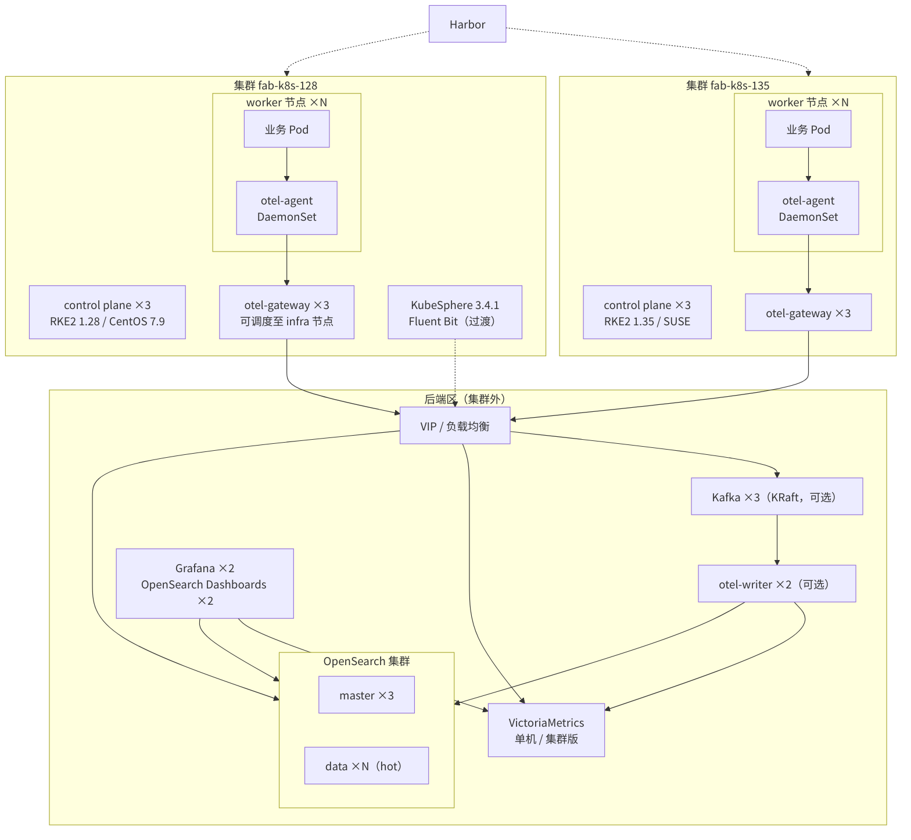

<details><summary>Mermaid 源码</summary>

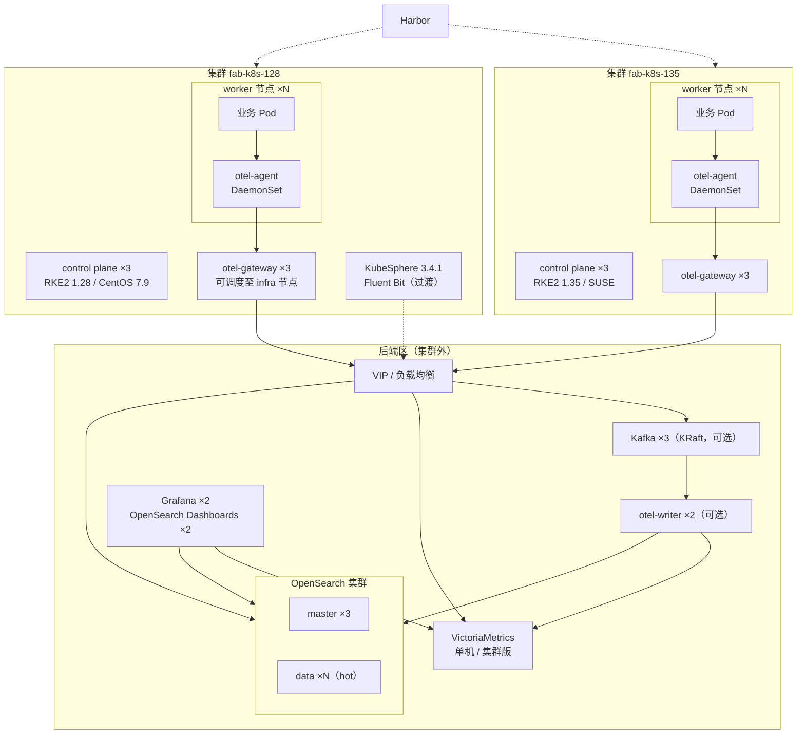
```mermaid
flowchart TB
    subgraph c135["集群 fab-k8s-135"]
        direction TB
        cp2["control plane ×3<br/>RKE2 1.35 / SUSE"]
        subgraph w2["worker 节点 ×N"]
            app2["业务 Pod"]
            ag2["otel-agent<br/>DaemonSet"]
        end
        gw2["otel-gateway ×3"]
    end
    subgraph c128["集群 fab-k8s-128"]
        direction TB
        cp1["control plane ×3<br/>RKE2 1.28 / CentOS 7.9"]
        subgraph w1["worker 节点 ×N"]
            app1["业务 Pod"]
            ag1["otel-agent<br/>DaemonSet"]
        end
        gw1["otel-gateway ×3<br/>可调度至 infra 节点"]
        ksn["KubeSphere 3.4.1<br/>Fluent Bit（过渡）"]
    end
    subgraph backend["后端区（集群外）"]
        direction TB
        subgraph osc["OpenSearch 集群"]
            osm["master ×3"]
            osd["data ×N（hot）"]
        end
        kfc["Kafka ×3（KRaft，可选）"]
        wrt["otel-writer ×2（可选）"]
        vmc["VictoriaMetrics<br/>单机 / 集群版"]
        gfa["Grafana ×2<br/>OpenSearch Dashboards ×2"]
        lb["VIP / 负载均衡"]
    end
    hb["Harbor"]

    app1 --> ag1 --> gw1
    app2 --> ag2 --> gw2
    gw1 --> lb
    gw2 --> lb
    ksn -.-> lb
    lb --> osc
    lb --> kfc
    lb --> vmc
    kfc --> wrt --> osc
    wrt --> vmc
    gfa --> osc
    gfa --> vmc
    hb -.-> c135
    hb -.-> c128
```

</details>

### 6.2 网络分区与端口

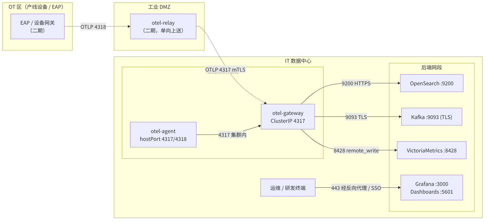

<details><summary>Mermaid 源码</summary>

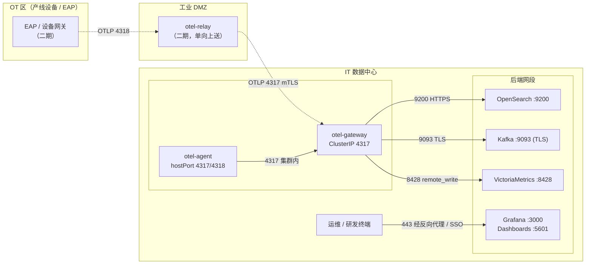
```mermaid
flowchart LR
    subgraph ot["OT 区（产线设备 / EAP）"]
        eap["EAP / 设备网关<br/>（二期）"]
    end
    subgraph dmz["工业 DMZ"]
        relay["otel-relay<br/>（二期，单向上送）"]
    end
    subgraph it["IT 数据中心"]
        subgraph k8sz["业务集群网段"]
            ag["otel-agent<br/>hostPort 4317/4318"]
            gw["otel-gateway<br/>ClusterIP 4317"]
        end
        subgraph bz["后端网段"]
            os["OpenSearch :9200"]
            kf["Kafka :9093 (TLS)"]
            vm["VictoriaMetrics :8428"]
            ui["Grafana :3000<br/>Dashboards :5601"]
        end
        ops["运维 / 研发终端"]
    end

    eap -. "OTLP 4318" .-> relay
    relay -. "OTLP 4317 mTLS" .-> gw
    ag -- "4317 集群内" --> gw
    gw -- "9200 HTTPS" --> os
    gw -- "9093 TLS" --> kf
    gw -- "8428 remote_write" --> vm
    ops -- "443 经反向代理 / SSO" --> ui
```

</details>

### 6.3 防火墙策略

| 源 | 目标 | 端口 | 协议 | 说明 |
|---|---|---|---|---|
| 业务集群节点 | OpenSearch | 9200 | HTTPS + Basic/证书 | Gateway 写入；过渡期 Fluent Bit 写入 |
| 业务集群节点 | Kafka | 9093 | TLS + SASL | 仅模式 B |
| 业务集群节点 | VictoriaMetrics | 8428 | HTTP(S) | remote_write，建议前置 vmauth 鉴权 |
| otel-writer | OpenSearch / VM | 9200 / 8428 | 同上 | 仅模式 B |
| 运维终端 | Grafana / Dashboards | 443 | HTTPS | 经反向代理，接入 LDAP / SSO |
| Pod | 本节点 otel-agent | 4317 / 4318 | OTLP | 仅集群内；NetworkPolicy 限制来源 |

安全说明：OTLP receiver 默认无鉴权。Agent 以 hostPort 暴露时，同网段任何主机都能写入，需要通过主机防火墙或 NetworkPolicy 限制为仅本节点 Pod 访问。

### 6.4 容量估算模型【待补充实际数据】

| 信号 | 估算公式 | 说明 |
|---|---|---|
| 日志 | 日均原始量 × 1.2（索引膨胀）× (1 + 副本数) × 30 天 | 先从现有 OpenSearch `_cat/indices` 统计近 7 天日均量 |
| Trace | 峰值 QPS × 每请求 Span 数 × 单 Span 约 1–2 KB × 86400 × 采样率 × (1 + 副本数) × 保留天数 | 建议 Trace 保留 7 天 |
| 指标 | 活跃时间序列数 × 采集频率 | VictoriaMetrics 单点每百万活跃序列约需数 GB 内存，按实测调整 |

---

## 7. 场景视图（+1 Scenarios）

用关键场景验证上述四个视图。

### 7.1 场景一：从指标告警定位到具体日志

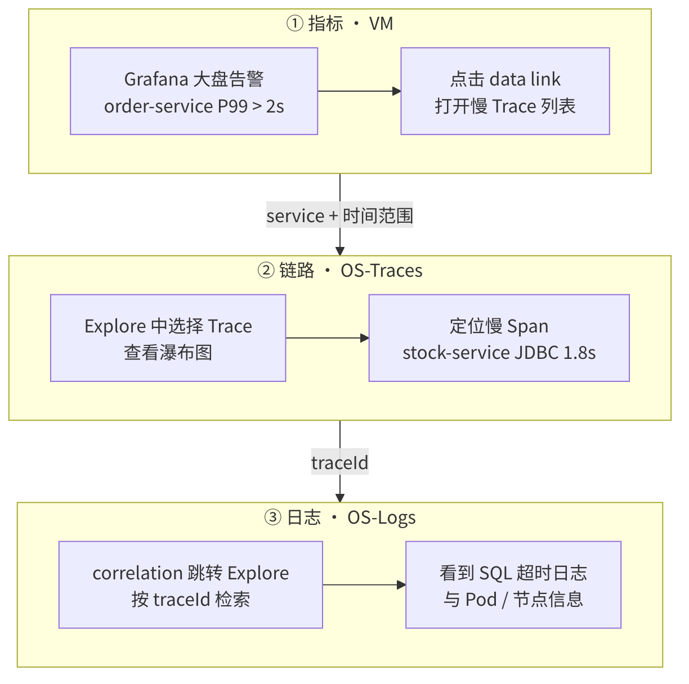

<details><summary>Mermaid 源码</summary>

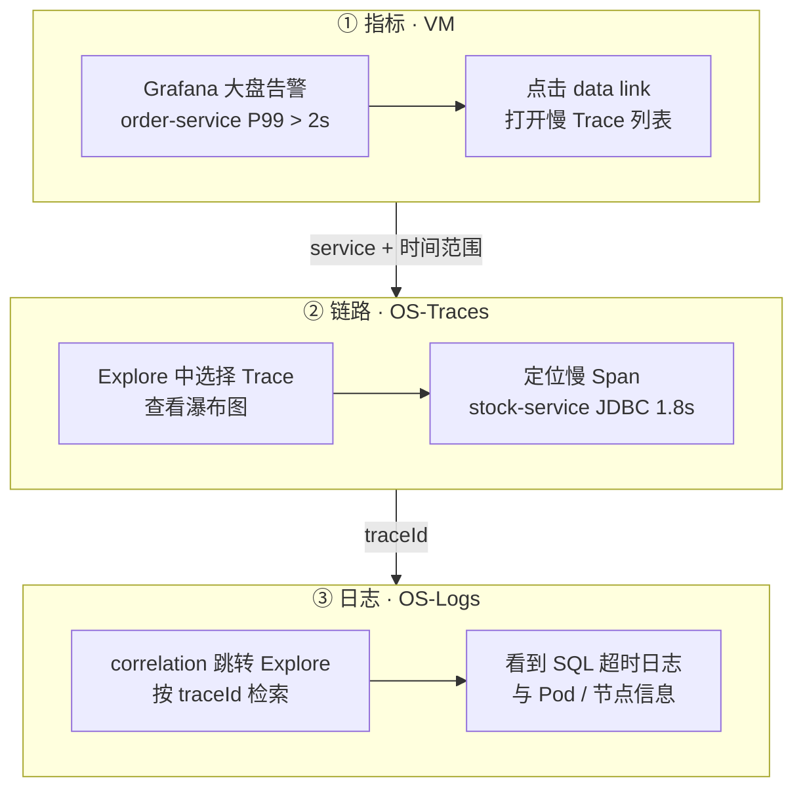
```mermaid
flowchart TB
    subgraph s1["① 指标 · VM"]
        direction LR
        a["Grafana 大盘告警<br/>order-service P99 > 2s"] --> b["点击 data link<br/>打开慢 Trace 列表"]
    end
    subgraph s2["② 链路 · OS-Traces"]
        direction LR
        c["Explore 中选择 Trace<br/>查看瀑布图"] --> d["定位慢 Span<br/>stock-service JDBC 1.8s"]
    end
    subgraph s3["③ 日志 · OS-Logs"]
        direction LR
        e["correlation 跳转 Explore<br/>按 traceId 检索"] --> f["看到 SQL 超时日志<br/>与 Pod / 节点信息"]
    end
    s1 -->|service + 时间范围| s2
    s2 -->|traceId| s3
```

</details>

说明：第①步不是点击 exemplar。VictoriaMetrics 不支持 exemplar，所以从告警到 Trace 的路径是"按服务和时间范围列出慢 Trace，再选一条"（J1）。如果需要从指标点直接跳到一条 Trace，要改用 Prometheus 或 Mimir 存指标（见 Q4）。第③步对应 J4，也可以在 OpenSearch Dashboards 中按 traceId 做更复杂的检索。

涉及视图：逻辑视图 3.2（关联模型）、3.4（统一查询与关联）、进程视图 4.3（关联时序）。

### 7.2 场景二：OpenSearch 停机维护 2 小时


<details><summary>Mermaid 源码</summary>

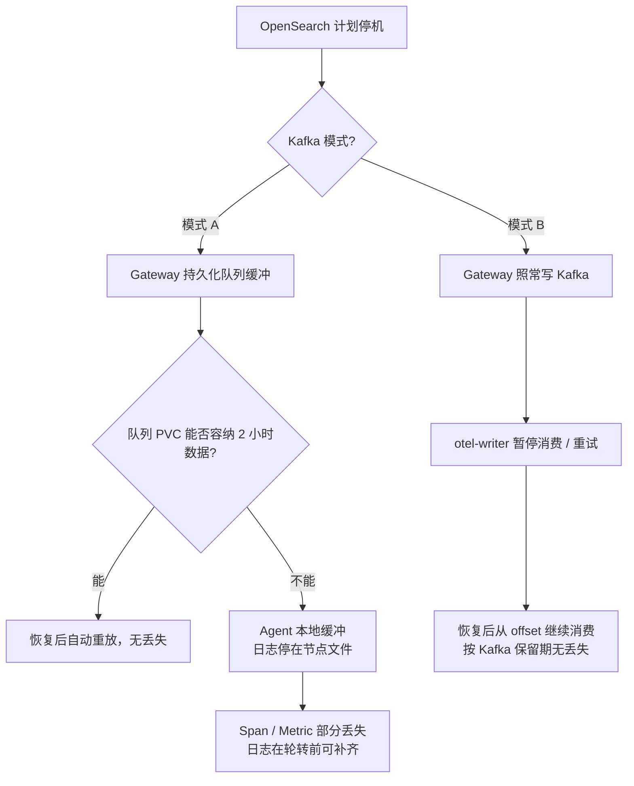
```mermaid
flowchart TB
    start["OpenSearch 计划停机"] --> q{"Kafka 模式?"}
    q -- "模式 A" --> a1["Gateway 持久化队列缓冲"]
    a1 --> a2{"队列 PVC 能否容纳 2 小时数据?"}
    a2 -- "能" --> ok1["恢复后自动重放，无丢失"]
    a2 -- "不能" --> a3["Agent 本地缓冲<br/>日志停在节点文件"]
    a3 --> a4["Span / Metric 部分丢失<br/>日志在轮转前可补齐"]
    q -- "模式 B" --> b1["Gateway 照常写 Kafka"]
    b1 --> b2["otel-writer 暂停消费 / 重试"]
    b2 --> ok2["恢复后从 offset 继续消费<br/>按 Kafka 保留期无丢失"]
```

</details>

结论：维护窗口长于 Gateway 队列可缓冲时长时，应启用模式 B。这也是 Kafka 是否启用的主要判断依据。

### 7.3 场景三：节点 drain / 重启

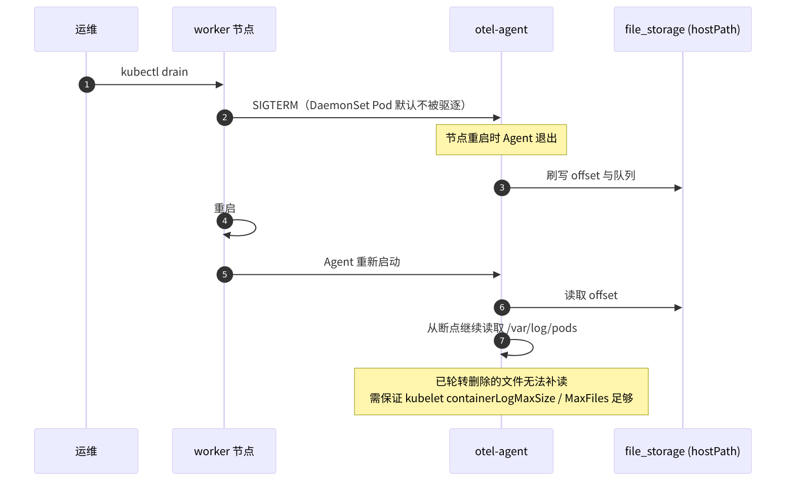

<details><summary>Mermaid 源码</summary>

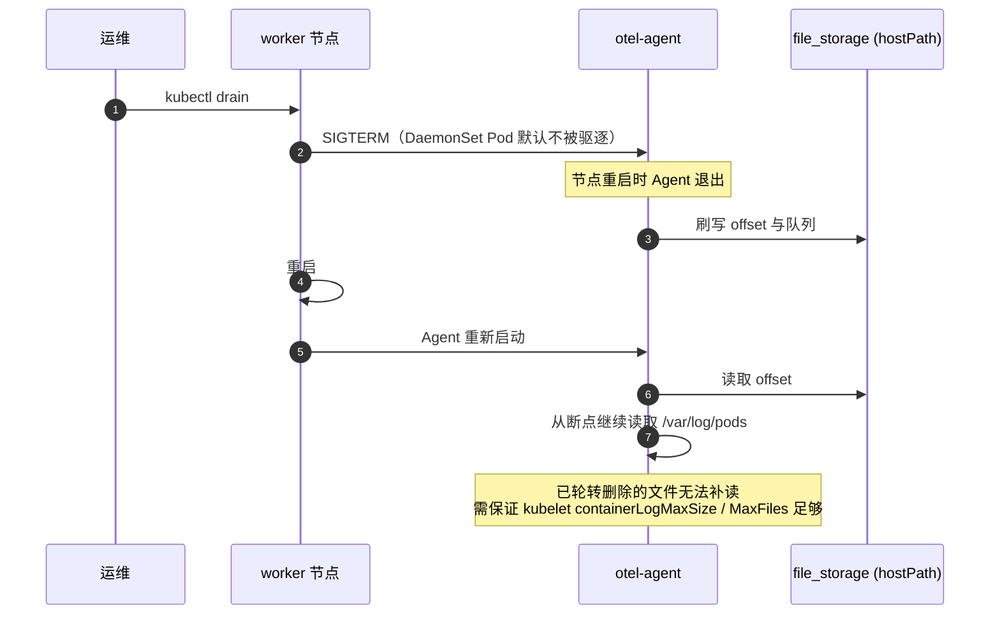
```mermaid
sequenceDiagram
    autonumber
    participant OP as 运维
    participant N as worker 节点
    participant AG as otel-agent
    participant FS as file_storage (hostPath)

    OP->>N: kubectl drain
    N->>AG: SIGTERM（DaemonSet Pod 默认不被驱逐）
    Note over AG: 节点重启时 Agent 退出
    AG->>FS: 刷写 offset 与队列
    N->>N: 重启
    N->>AG: Agent 重新启动
    AG->>FS: 读取 offset
    AG->>AG: 从断点继续读取 /var/log/pods
    Note over AG: 已轮转删除的文件无法补读<br/>需保证 kubelet containerLogMaxSize / MaxFiles 足够
```

</details>

### 7.4 场景四：业务从 1.28 迁移到 1.35

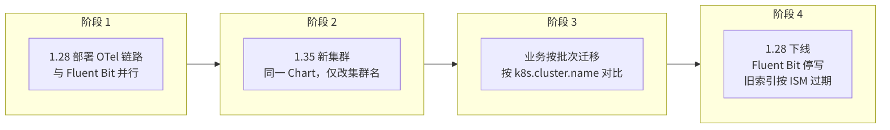

<details><summary>Mermaid 源码</summary>

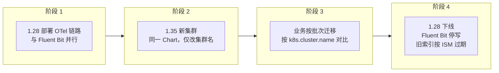
```mermaid
flowchart LR
    subgraph p1["阶段 1"]
        x1["1.28 部署 OTel 链路<br/>与 Fluent Bit 并行"]
    end
    subgraph p2["阶段 2"]
        x2["1.35 新集群<br/>同一 Chart，仅改集群名"]
    end
    subgraph p3["阶段 3"]
        x3["业务按批次迁移<br/>按 k8s.cluster.name 对比"]
    end
    subgraph p4["阶段 4"]
        x4["1.28 下线<br/>Fluent Bit 停写<br/>旧索引按 ISM 过期"]
    end
    p1 --> p2 --> p3 --> p4
```

</details>

迁移期间，同一服务在两个集群的数据写入相同索引，通过 `k8s.cluster.name` 区分，查询与大盘无需修改。

### 7.5 场景五：Kafka 模式切换


<details><summary>Mermaid 源码</summary>

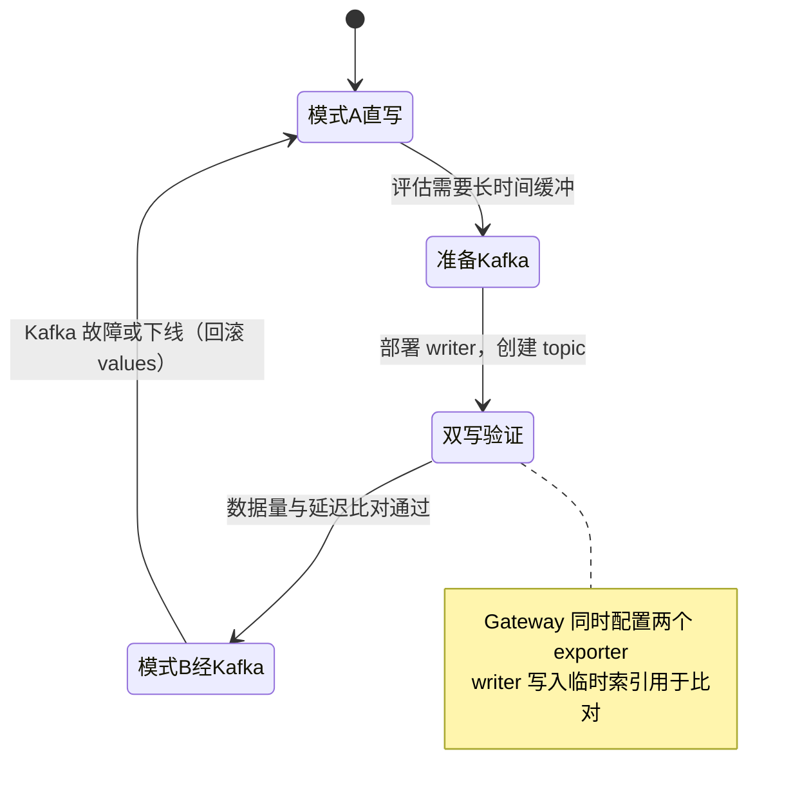
```mermaid
stateDiagram-v2
    [*] --> 模式A直写
    模式A直写 --> 准备Kafka : 评估需要长时间缓冲
    准备Kafka --> 双写验证 : 部署 writer，创建 topic
    双写验证 --> 模式B经Kafka : 数据量与延迟比对通过
    模式B经Kafka --> 模式A直写 : Kafka 故障或下线（回滚 values）
    note right of 双写验证
        Gateway 同时配置两个 exporter
        writer 写入临时索引用于比对
    end note
```

</details>

---

## 8. 数据生命周期


<details><summary>Mermaid 源码</summary>


```mermaid
flowchart LR
    w([写入]) --> lh["日志 hot<br/>0–7 天"]
    lh -->|"7 天后<br/>force_merge + 只读"| lw["日志 warm<br/>7–30 天"]
    lw -->|30 天后| d1([删除])
    w --> th["Trace hot<br/>0–7 天"]
    th -->|"7 天后（可配置）"| d2([删除])
```

</details>

| 数据 | 索引 | 保留 | 策略 |
|---|---|---|---|
| 应用日志 | `otel-v1-logs-*` | 30 天 | ISM：rollover（按大小或天）→ 7 天 warm → 30 天删除 |
| Trace | `otel-v1-apm-span-*` | 7 天【待确认】 | ISM：rollover → 7 天删除 |
| 指标 | VictoriaMetrics | 30–90 天 | `-retentionPeriod` 参数 |
| 旧日志（Fluent Bit） | 现有索引 | 30 天自然过期 | 迁移完成后不再写入 |

---

## 9. 非功能设计

| 维度 | 设计 |
|---|---|
| 可用性 | Gateway 3 副本 + PDB；OpenSearch 3 master；后端组件跨机架/宿主机分布 |
| 业务隔离 | Agent 设置 CPU/内存 limit 与 `memory_limiter`；javaagent 导出为异步，失败不阻塞业务线程 |
| 数据可靠性 | 日志靠节点文件 + offset 持久化；Span/Metric 靠多级持久化队列；可选 Kafka |
| 安全 | Collector → 后端全链路 TLS；OpenSearch 启用 security 插件，按 BU / 产线划分租户与索引权限；Gateway 统一脱敏 |
| 合规 | 配方、工艺参数、良率等字段列入黑名单，在 Gateway `transform` / `attributes` 处理器中删除或哈希 |
| 自监控 | 所有 Collector 暴露 `:8888` 内部指标，重点监控 `otelcol_exporter_send_failed_*`、`otelcol_exporter_queue_size`、`otelcol_processor_refused_*` |
| 时钟 | 全部节点与后端主机统一 NTP 源，偏差 < 100ms |

---

## 10. 实施路线


<details><summary>Mermaid 源码</summary>

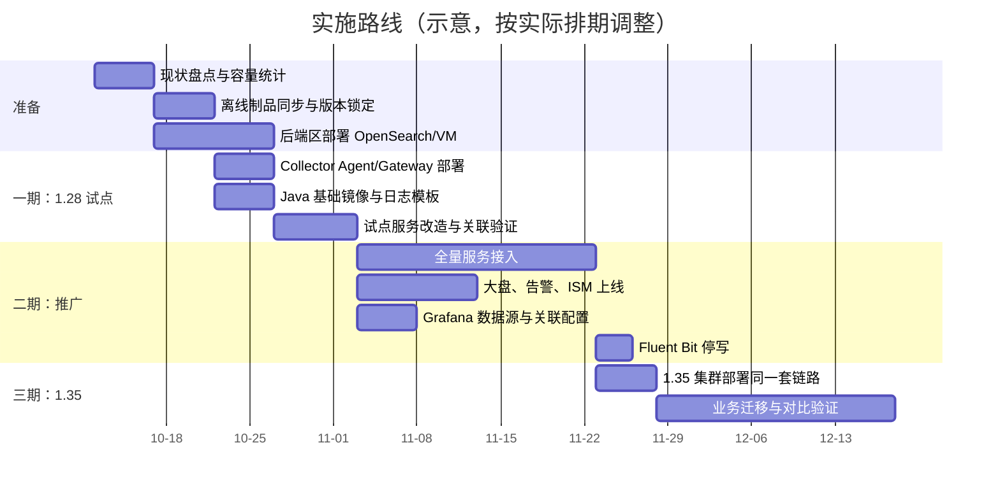
```mermaid
gantt
    title 实施路线（示意，按实际排期调整）
    dateFormat YYYY-MM-DD
    axisFormat %m-%d
    todayMarker off
    section 准备
    现状盘点与容量统计          :a1, 2026-10-12, 5d
    离线制品同步与版本锁定      :a2, after a1, 5d
    后端区部署 OpenSearch/VM    :a3, after a1, 10d
    section 一期：1.28 试点
    Collector Agent/Gateway 部署 :b1, after a2, 5d
    Java 基础镜像与日志模板      :b2, after a2, 5d
    试点服务改造与关联验证       :b3, after b1, 7d
    section 二期：推广
    全量服务接入                 :c1, after b3, 20d
    大盘、告警、ISM 上线         :c2, after b3, 10d
    Grafana 数据源与关联配置     :c4, after b3, 5d
    Fluent Bit 停写              :c3, after c1, 3d
    section 三期：1.35
    1.35 集群部署同一套链路      :d1, after c1, 5d
    业务迁移与对比验证           :d2, after d1, 20d
```

</details>

### 10.1 验收标准

| 编号 | 标准 |
|---|---|
| AC-1 | 任意一条业务日志中的 trace_id，可在 OpenSearch 中查到对应 Span，反之亦然 |
| AC-2 | 跨服务调用（HTTP / Feign / MQ）链路完整，无断链 |
| AC-3 | 重启任一 Gateway 副本或任一节点，日志无丢失（以序号日志验证） |
| AC-4 | OpenSearch 停机 30 分钟，恢复后数据自动补齐（模式 A）|
| AC-5 | 1.28 与 1.35 使用同一份 Chart 与 values，仅集群差异文件不同 |
| AC-6 | 关闭全部 Collector，业务接口延迟无明显变化 |
| AC-7 | J1–J5 在 Grafana 中均可一键跳转；Trace → 日志在 span 起止 ±2s 时间窗内不漏日志；`flags:1` 日志的断链率低于阈值（如 1%） |

---

## 11. 风险与应对

| 风险 | 影响 | 应对 |
|---|---|---|
| KubeSphere 3.4 在 1.28 / 1.35 上的兼容性 | 平台功能异常 | 新链路不依赖 KubeSphere；1.35 评估 KubeSphere 4.x 或不再使用 |
| OpenSearch exporter 为 alpha 阶段（traces / logs），模板管理为 best-effort | 配置字段变更、行为差异；模板失败时静默回退到动态映射 | 锁定版本；升级前回归测试；模板预装（ADR-10）；备选 Data Prepper |
| Grafana 插件读取 `span.attributes`（Data Prepper 格式），exporter 写在顶层 `attributes` | 瀑布图中 span tags 可能为空 | 试点阶段实测；必要时在索引模板中加 alias 字段或改用 Data Prepper 写入 |
| 头部采样导致日志有 traceId 但查不到 Span | 用户误以为关联失效 | 写入 `flags` 并在界面标注；监控断链率（3.4.6）；二期尾部采样 |
| OpenSearch 2.6 关联能力弱；数据源 `jsonData.version` 与实际版本不一致 | Trace Analytics 无日志关联；插件查询语法不匹配 | 升级至 2.19.x 或 3.x（Q9）；`version` 随升级修改 |
| Grafana 与插件版本漂移 | 关联配置失效、离线环境无法自动修复 | 成组锁定版本，`preinstall_disabled`，升级前回归 AC-7 |
| Correlations 对 OpenSearch traces 的兼容性未验证 | J3 / J4 无法实现 | 试点首周验证；备选 dataLinks 相对 URL，或 Trace 后端改为 Tempo / VictoriaTraces（Q11） |
| exporter 不生成 Service Map 索引 | 插件的 Service Map 与 OSD 服务图不可用 | 二期用 servicegraph connector + Node Graph（J6） |
| OBI（eBPF 零代码埋点）不支持 CentOS 7.9 的 3.10 内核 | 1.28 集群无法用 eBPF 补埋点 | 只在 SUSE / 1.35 上评估，一期不引入 |
| CentOS 7.9 为 cgroup v1，且已停止维护 | 1.35 kubelet 默认拒绝 cgroup v1 | 1.35 仅使用 SUSE 节点并确认 cgroup v2 |
| RKE2 自带 containerd | containerd 版本随 RKE2 版本变化 | 不单独升级 containerd，跟随 RKE2 发行版 |
| 业务残留 Sleuth / 手动 SDK | trace_id 仍不一致 | 制定依赖黑名单，CI 中用 `mvn dependency:tree` 检查 |
| 日志轮转快于 Collector 恢复 | 故障期间日志丢失 | 调大 kubelet `containerLogMaxSize` / `containerLogMaxFiles`；监控 Agent 延迟 |
| 敏感工艺数据进入可观测系统 | 合规风险 | Gateway 统一脱敏；Span 属性白名单评审 |
| 索引数量膨胀 | OpenSearch 不稳定 | 禁止以高基数字段做动态索引名；按信号 + 日期滚动 |

---

## 12. 待确认事项

| 编号 | 事项 | 影响章节 |
|---|---|---|
| Q1 | Spring Boot / JDK 版本；是否存在 Sleuth 或 micrometer-tracing 依赖 | 5.2 |
| Q2 | 日志框架（Logback / Log4j2）与 JSON 编码器；提供一行样例日志 | 3.3、4.1 |
| Q3 | OpenSearch 2.6 是 KubeSphere 集群内部署还是独立部署 | 6.1、10 |
| Q4 | 指标后端选择 VictoriaMetrics 还是 Prometheus。VM 不支持 exemplar；若要求从指标点直接跳到一条 Trace，需要 Prometheus 或 Mimir | ADR-05、3.4、7.1 |
| Q5 | 服务间是否有 MQ / 网关（Spring Cloud Gateway、ingress-nginx、RocketMQ 等） | 4.3、AC-2 |
| Q6 | 日志日均量、峰值 QPS、Trace 保留天数 | 6.4、8 |
| Q7 | 现有 Kafka 版本、是否可复用 | ADR-07 |
| Q8 | SUSE 节点的具体发行版本及 cgroup 版本 | 11 |
| Q9 | OpenSearch 能否从 2.6 升级到 2.19.x 或 3.x（3.5 起 Discover Traces 与 Correlations 原生识别 otel-v1 索引） | 3.4、5.4、11 |
| Q10 | 现有 Grafana 的版本、部署方式（是否 KubeSphere 内置）、数据库类型 | 3.4.7、5.4 |
| Q11 | 是否接受 Trace 改存 Tempo 或 VictoriaTraces，以获得原生的 Trace 与日志关联 | ADR-05、3.4、附录 A |

---

## 附录 A 业界调研

调研时间为 2026-10，版本号以各项目 GitHub releases 为准。标注【未验证】的内容来自二手资料或推断，引用前需要再核对原文。

### A.1 商业厂商

| 厂商 | 关联机制 | 可借鉴点 |
|---|---|---|
| Datadog | Unified Service Tagging：三类信号都带 `env`、`service`、`version` 标签；Java tracer 把 trace_id、span_id 注入 MDC，日志与 Trace 自动关联 | 三个标签对应 OTel 的 `deployment.environment.name`、`service.name`、`service.version`，3.3 已对齐 |
| Dynatrace | OneAgent 做日志富化，把 trace_id、span_id 和实体信息写入日志 | 关联字段由 Agent 统一注入，不依赖业务代码 |
| Splunk Observability | Related Content：在指标、Trace、日志之间按共享字段提供跳转 | 要求各信号的字段名完全一致，否则不出现跳转；与 3.4.3 字段对照表的思路相同 |
| New Relic | Logs in context：Agent 给日志加上 trace 与 span 标识，在 Trace 详情中直接显示日志 | 具体字段名【未验证】 |
| Honeycomb | BubbleUp：在热力图上框选异常点，自动对比异常组与基线组的属性分布 | 异常对比分析，本方案一期未覆盖 |
| 阿里云 ARMS | 调用链列表每一行有"日志"按钮；错误 / 慢 Trace 对比分析（各取 1000 条）；Java 应用通过 MDC 把 traceId 写入业务日志 | 存储分工与本方案相似：Prometheus 存指标，SLS 存日志和链路 |
| 腾讯云 APM | 链路与 CLS 日志关联 | 关联方式与配置细节【未验证】 |

共同点：关联依赖统一的资源身份和 Agent 自动注入的 ID，不依赖业务自己生成的 ID。这也是本方案把业务 UUID 改名为 request_id 的原因。

### A.2 大厂实践

| 来源 | 做法 | 公开数据 |
|---|---|---|
| Uber | 日志平台从 Elasticsearch 迁到 ClickHouse，采用与 schema 无关的存储结构 | 被索引的字段只有约 5% 真正被查询；单节点写入约为 ES 的 10 倍；硬件成本降低一半以上 |
| Cloudflare | 日志分析迁到 ClickHouse | CPU 和内存消耗降低约 8 倍 |
| 美团 CAT | 自研监控，用固定维度（Type / Name）聚合以控制基数；Message-ID 跨 RPC 传递，串起调用链 | 基数控制要在设计阶段确定 |
| ClickHouse ClickStack | ClickHouse + HyperDX + OTel Collector，三类信号存在同一个库 | 关联在同一个查询引擎内完成 |

携程、B 站等也有 ClickHouse 日志平台的公开分享，本次未逐条核对原文，不引用具体数据【未验证】。

### A.3 开源平台对比

| 平台 | 版本 | 存储 | 三信号关联 | 与本方案的关系 |
|---|---|---|---|---|
| Grafana LGTM | Grafana v13.2.3，Loki v3.7.8，Tempo v3.1.0，Mimir 3.2.2 | 对象存储 | Tempo 数据源原生支持 tracesToLogs / tracesToMetrics；Mimir 支持 exemplar | Tempo 的 tracesToLogs 可以指向 OpenSearch 日志数据源（插件 2.31.1 修复了相关问题），是 A.6 路线 2 的基础 |
| VictoriaMetrics 系 | VM v1.153.0，VictoriaLogs v1.53.0，VictoriaTraces v0.12.0 | 本地盘 | VictoriaTraces 提供 Jaeger 查询 API，可在 Grafana 中用 Jaeger 数据源接入；VM 不支持 exemplar，官方建议用 correlations | 指标已用 VM；VictoriaTraces 仍为 0.x 版本 |
| Jaeger | v2.22.0 | ES / OpenSearch / Cassandra 等 | v2 基于 OTel Collector 构建；SPM 用 spanmetrics 生成 RED 指标存入 Prometheus | Grafana 的 Jaeger 插件从 13.2 起独立发布，要求 Grafana ≥ 12.3.0 |
| OpenSearch Observability | OpenSearch 3.x，Data Prepper 2.16.0 | OpenSearch | 2.15 起 Trace 详情显示关联日志；3.5 起 Discover Traces 自动识别 `otel-v1-apm-span*` 与 `logs-otel-v1*`，并提供 Correlations；3.6 起提供 APM | 原生关联需要升级（Q9）；APM 服务图依赖 Data Prepper；Data Prepper 2.15.0 起 `otel_*` source 改名为 `otlp_*` |
| Elastic Observability | Elasticsearch v9.5.5 | Elasticsearch | APM 原生关联日志与指标 | 2024 年起增加 AGPLv3 许可选项；现有栈是 OpenSearch，不建议切换 |
| SigNoz | v0.145.0 | ClickHouse | OTel 原生，Trace 与日志双向跳转 | 一体化平台，会替换现有 OpenSearch 日志栈 |
| ClickStack（HyperDX） | 未核对 | ClickHouse | 三类信号同库 | 同上 |
| Uptrace | releases/latest 指向 v2.1.0-rc.1 | ClickHouse | OTel 原生；部分特性【未验证】 | 最新版本为 RC，不适合锁定为生产版本 |
| OpenObserve | releases/latest 指向 v1.1.0-rc1 | 对象存储（Parquet） | 三类信号一体；部分特性【未验证】 | 同上 |
| Apache SkyWalking | v11.0.0 | BanyanDB / Elasticsearch 等 | 自有探针体系，可接收 OTLP Trace | 与 OTel javaagent 路线重叠 |
| DeepFlow | v7.2.2 | ClickHouse | eBPF 零侵入采集；部分特性【未验证】 | eBPF 对内核版本有要求，CentOS 7.9 受限 |
| Perses | v0.54.0 | 不涉及（仪表盘） | 仪表盘即代码，CNCF 沙箱项目 | 可作为 Grafana 大盘 GitOps 的替代方案，暂不引入 |

选型前需单独核对许可证，例如 Grafana、Loki、Tempo、Mimir 为 AGPLv3。

### A.4 标准与趋势

- OTel 规范状态：Tracing 稳定；Metrics 的 API 稳定，SDK 部分稳定；Logs 稳定；Profiles 协议仍为 Development（官方博客称 Public Alpha）。三类信号都可以作为长期标准，Profiles 暂不纳入。
- 语义约定：`deployment.environment` 已在 semconv v1.27 弃用，改为 `deployment.environment.name`。
- 零代码埋点：OBI（OpenTelemetry eBPF Instrumentation）处于 Development 阶段，最新版本 v0.14.0。要求内核 ≥ 5.8（或带回移补丁的 RHEL 4.18）并开启 BTF，CentOS 7.9 的 3.10 内核不满足。OBI 与 Grafana Beyla 的渊源【未验证】。
- 关联逐步变成平台配置：Grafana Correlations 在 10.0 为 public preview，11.3 起 external 类型 GA，12.0 起 trace correlations GA；OpenSearch 3.5 起提供 Correlations。
- 存储向列存集中：Uber、Cloudflare 的日志平台，以及 SigNoz、ClickStack、Uptrace 都基于 ClickHouse。

### A.5 共性模式

1. 统一资源身份：三类信号共用 service、env、version 等标签，字段名完全一致（Datadog、Splunk）。
2. 日志与 Trace 双向跳转，并带时间窗（Tempo tracesToLogs、ARMS 日志按钮、New Relic logs in context）。
3. 以服务为入口：从服务列表或服务图进入，再下钻到 Trace 和日志（ARMS、Jaeger SPM、OpenSearch APM）。
4. 指标到 Trace 靠共享标签加时间窗，exemplar 是加分项，只在 Prometheus / Mimir 体系中可用。
5. 关联失败要让用户看见：区分 traceId 缺失、未采样和数据丢失，不能静默返回空结果。
6. 采样感知：在日志上标记是否已采样，避免用户误判。
7. 基数护栏：固定维度或标签白名单（美团 CAT）。
8. 异常对比分析：错误 / 慢请求与正常请求的属性分布对比（Honeycomb BubbleUp、ARMS）。

### A.6 对本方案的启示

| 模式 | 本方案现状 | 差距与后续 |
|---|---|---|
| 1 统一资源身份 | 3.3、3.4.3 字段规范与对照表 | 已覆盖 |
| 2 日志与 Trace 双向跳转 | J3、J4，±2s 时间窗 | 依赖 Correlations，需实测；瀑布图上没有 Tempo 那样的原生日志入口 |
| 3 以服务为入口 | RED 大盘 + `var-service` | 服务图放在二期（J6） |
| 4 指标到 Trace | J1，共享标签 + 时间窗 | 需要 exemplar 时改用 Prometheus 或 Mimir（Q4） |
| 5 关联失败可见 | 3.4.6 关联质量监控 | 已覆盖 |
| 6 采样感知 | `flags` 字段与 `flags:1` 查询 | 二期尾部采样 |
| 7 基数护栏 | `keep_keys` 白名单 | 上线后在 VM 侧监控活跃序列数 |
| 8 异常对比分析 | 无 | 一期不做，后续评估 |

Trace 存储与关联的三条路线：

| 路线 | 做法 | 收益 | 代价 |
|---|---|---|---|
| 1（当前方案） | OpenSearch 升级到 2.19.x / 3.x，指标用 VM，Grafana Correlations 做跳转 | 改动最小，沿用现有 OpenSearch | J3、J4 需实测；span tags 映射需实测；无 exemplar |
| 2 | Trace 改存 Tempo 或 VictoriaTraces，日志保留在 OpenSearch | Tempo 数据源的 tracesToLogs 可以指向 OpenSearch，瀑布图上有原生日志入口 | 新增一个存储组件；Tempo 生产部署建议使用对象存储（如 MinIO） |
| 3 | OpenSearch 升级到 3.6，用 OSD 的 Discover Traces、Correlations、APM | 日志与 Trace 在同一产品内原生关联 | 需要引入 Data Prepper；指标仍在 Grafana 中查看，存在两个入口 |

ClickHouse 一体化平台（SigNoz、ClickStack）代表了趋势，但会替换现有 OpenSearch 日志栈和 30 天数据，一期不建议。推荐先按路线 1 试点，J3、J4 实测不通过时再在路线 2 和路线 3 之间选择（Q9、Q11）。

### A.7 来源

标准与 OTel：

- https://opentelemetry.io/docs/specs/status/
- https://github.com/open-telemetry/opentelemetry-ebpf-instrumentation
- https://opentelemetry.io/docs/zero-code/obi/
- https://raw.githubusercontent.com/open-telemetry/opentelemetry-java-instrumentation/main/docs/logger-mdc-instrumentation.md
- https://raw.githubusercontent.com/open-telemetry/opentelemetry-collector-contrib/main/connector/servicegraphconnector/README.md
- https://raw.githubusercontent.com/open-telemetry/opentelemetry-collector-contrib/main/exporter/opensearchexporter/README.md

Grafana：

- https://grafana.com/docs/grafana/latest/fundamentals/exemplars/
- https://grafana.com/docs/grafana/latest/administration/correlations/create-a-new-correlation/
- https://grafana.com/docs/grafana/latest/administration/correlations/use-correlations-in-visualizations/
- https://grafana.com/docs/grafana/latest/whatsnew/whats-new-in-v11-3/
- https://grafana.com/docs/grafana/latest/whatsnew/whats-new-in-v12-0/
- https://grafana.com/docs/grafana/latest/panels-visualizations/visualizations/node-graph/
- https://grafana.com/docs/grafana/latest/setup-grafana/configure-grafana/
- https://grafana.com/docs/grafana/latest/datasources/tempo/configure-tempo-data-source/configure-trace-to-logs/
- https://grafana.com/docs/grafana/latest/datasources/jaeger/
- https://grafana.com/docs/plugins/grafana-opensearch-datasource/latest/configure/
- https://grafana.com/docs/plugins/grafana-opensearch-datasource/latest/query-editor/
- https://github.com/grafana/opensearch-datasource
- https://grafana.com/api/plugins/victoriametrics-metrics-datasource
- https://github.com/grafana/tempo

VictoriaMetrics：

- https://github.com/VictoriaMetrics/VictoriaMetrics/issues/1169
- https://github.com/VictoriaMetrics/VictoriaMetrics/pull/5982
- https://github.com/VictoriaMetrics/VictoriaMetrics/pull/6135
- https://docs.victoriametrics.com/victoriametrics/integrations/grafana/datasource/
- https://docs.victoriametrics.com/victoriatraces/
- https://docs.victoriametrics.com/victorialogs/

OpenSearch：

- https://docs.opensearch.org/2.15/observing-your-data/trace/ta-dashboards/
- https://docs.opensearch.org/latest/observing-your-data/exploring-observability-data/discover-traces/
- https://docs.opensearch.org/latest/observing-your-data/exploring-observability-data/correlations/
- https://docs.opensearch.org/latest/observing-your-data/apm/index/
- https://docs.opensearch.org/latest/data-prepper/common-use-cases/trace-analytics/

开源平台：

- https://github.com/SigNoz/signoz
- https://signoz.io/docs/traces-management/guides/correlate-traces-and-logs/
- https://clickhouse.com/docs/use-cases/observability/clickstack/overview
- https://github.com/uptrace/uptrace
- https://github.com/openobserve/openobserve
- https://skywalking.apache.org/docs/main/latest/en/setup/backend/otlp-trace/
- https://github.com/deepflowio/deepflow
- https://www.elastic.co/pricing/faq/licensing
- https://www.jaegertracing.io/docs/latest/spm/
- https://github.com/perses/perses

商业厂商：

- Datadog：https://docs.datadoghq.com/getting_started/tagging/unified_service_tagging/ ，https://docs.datadoghq.com/tracing/other_telemetry/connect_logs_and_traces/java/
- Dynatrace：https://docs.dynatrace.com/docs/analyze-explore-automate/logs/lma-log-enrichment
- Splunk：https://docs.splunk.com/observability/en/metrics-and-metadata/relatedcontent.html
- New Relic：https://docs.newrelic.com/docs/logs/logs-context/logs-in-context/
- Honeycomb：https://docs.honeycomb.io/investigate/analyze/identify-outliers/
- 阿里云 ARMS：https://help.aliyun.com/zh/arms/application-monitoring/user-guide/trace-explorer ，https://help.aliyun.com/zh/arms/application-monitoring/use-cases/associate-trace-ids-with-business-logs-for-a-java-application
- 腾讯云 APM：https://cloud.tencent.com/document/product/1463/57462

大厂实践：

- Uber：https://www.uber.com/blog/logging/
- Cloudflare：https://blog.cloudflare.com/log-analytics-using-clickhouse/
- 美团 CAT：https://tech.meituan.com/2018/11/01/cat-in-depth-java-application-monitoring.html
- ClickStack：https://clickhouse.com/blog/clickstack-a-high-performance-oss-observability-stack-on-clickhouse
