# 基于 OpenTelemetry 的统一可观测平台架构设计

| 项目 | 内容 |
|---|---|
| 文档版本 | v0.1（草案） |
| 适用范围 | RKE2 1.28.x（CentOS 7.9）与 RKE2 1.35.x（SUSE）业务集群 |
| 信号范围 | Traces / Metrics / Logs |
| 文档状态 | 待评审，标注【待确认】的内容需补充现场信息 |

---

## 1. 背景与目标

### 1.1 现状

| 维度 | 现状 |
|---|---|
| K8s | RKE2 安装，1.28.2，≥3 个 control plane，后续新建 1.35.x 集群 |
| 平台 | KubeSphere 3.4.1 |
| 日志采集 | KubeSphere 管理的 Fluent Bit（DaemonSet） |
| 日志缓冲 | 已有 Kafka |
| 日志存储 | OpenSearch 2.6，保留 30 天 |
| 应用 | Spring Boot，JSON 日志，已集成 OTel SDK 但 trace_id 无效（业务自生成 UUID） |
| 环境 | 完全离线，私有 Harbor |

### 1.2 核心问题

1. 日志中的 trace_id 来自业务 UUID，与真实 Span 无关，三类信号无法关联。
2. 可观测能力绑定在 KubeSphere 3.4 上。KubeSphere 3.4 官方支持的 K8s 版本上限低于 1.28【待核实官方兼容矩阵】，且 4.x 不支持从 3.x 原地升级，1.35 上无法沿用现有日志栈。
3. 需要在 1.28 与 1.35 两个集群并存期间，日志系统持续可用。

### 1.3 设计目标

| 编号 | 目标 |
|---|---|
| G1 | Traces / Metrics / Logs 统一基于 OTel 采集，通过 trace_id 相互跳转 |
| G2 | 采集链路与 KubeSphere 解耦，1.28 与 1.35 使用同一套 Helm Chart 和配置 |
| G3 | 存储后端部署在业务集群之外，集群升级、迁移、重建不影响数据 |
| G4 | Kafka 作为可选缓冲层，通过配置开关启用，应用与 Agent 无感 |
| G5 | 完全离线可部署、可升级，所有制品版本锁定 |
| G6 | 可观测平台故障时不影响业务（宁可丢数据，不可拖慢应用） |

### 1.4 非目标

- 本期不改造 MES / EAP / SECS-GEM 等遗留系统，仅预留接入点。
- 本期不做 K8s 集群升级本身，只保证采集链路在两个版本上可用。

---

## 2. 架构总览

### 2.1 系统上下文

Mermaid 源码

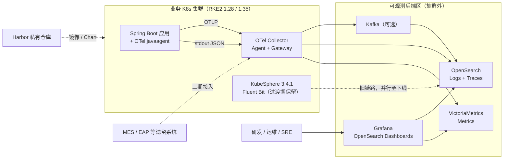
```mermaid
flowchart LR
    user["研发 / 运维 / SRE"]
    subgraph biz["业务 K8s 集群（RKE2 1.28 / 1.35）"]
        app["Spring Boot 应用<br/>+ OTel javaagent"]
        col["OTel Collector<br/>Agent + Gateway"]
        ks["KubeSphere 3.4.1<br/>Fluent Bit（过渡期保留）"]
    end
    subgraph obs["可观测后端区（集群外）"]
        kafka["Kafka（可选）"]
        os["OpenSearch<br/>Logs + Traces"]
        vm["VictoriaMetrics<br/>Metrics"]
        ui["Grafana<br/>OpenSearch Dashboards"]
    end
    harbor["Harbor 私有仓库"]
    legacy["MES / EAP 等遗留系统"]

    app -- "OTLP" --> col
    app -- "stdout JSON" --> col
    col --> kafka
    col --> os
    col --> vm
    kafka --> os
    ks -. "旧链路，并行至下线" .-> os
    user --> ui
    ui --> os
    ui --> vm
    harbor -. "镜像 / Chart" .-> biz
    legacy -. "二期接入" .-> col
```

### 2.2 关键架构决策（ADR 摘要）

| 编号 | 决策 | 理由 | 代价 |
|---|---|---|---|
| ADR-01 | 采集统一使用 OTel Collector（contrib 发行版），不再依赖 KubeSphere 的 fluentbit-operator | 与 KubeSphere 版本解耦；一个组件覆盖三类信号 | 需要自行维护 Collector 配置 |
| ADR-02 | 使用官方 `opentelemetry-collector` Helm Chart 部署，不引入 OTel Operator | 无 CRD、无 cert-manager 依赖，1.28/1.35 通用，离线镜像最少 | 放弃 Operator 的自动注入，javaagent 由基础镜像提供 |
| ADR-03 | 应用使用 OTel Java Agent，移除手动 SDK 初始化 | 避免两套 SDK 冲突，自动注入 MDC 的 trace_id | 需要统一基础镜像 |
| ADR-04 | 日志走 stdout + filelog，不走 OTLP 日志导出 | Collector 故障或升级时日志留在节点文件，恢复后断点续读 | 需要在 Collector 侧解析 JSON 与 trace_id |
| ADR-05 | Logs 与 Traces 存 OpenSearch，Metrics 存 VictoriaMetrics | OpenSearch exporter 的 metrics 处于 development 阶段；时序数据更适合 TSDB | 多维护一个存储组件 |
| ADR-06 | 后端部署在集群外（VM / 物理机） | 满足 G3，集群迁移不搬数据 | 需要单独的主机资源与运维 |
| ADR-07 | Kafka 为可选层，默认关闭 | 减少有状态组件；需要时只改 Gateway 配置 | 关闭时缓冲能力受限于 Gateway 持久化队列 |
| ADR-08 | 一期只做头部采样（SDK 端），不做尾部采样 | 尾部采样需要按 trace_id 路由，复杂度高 | 无法 100% 保留错误/慢请求，需要时二期引入 |

---

## 3. 逻辑视图（Logical View）

关注系统提供哪些功能，以及功能模块如何划分。

### 3.1 分层逻辑架构

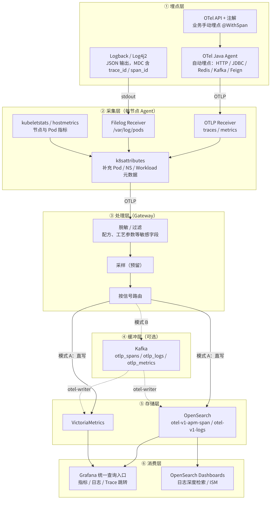

Mermaid 源码

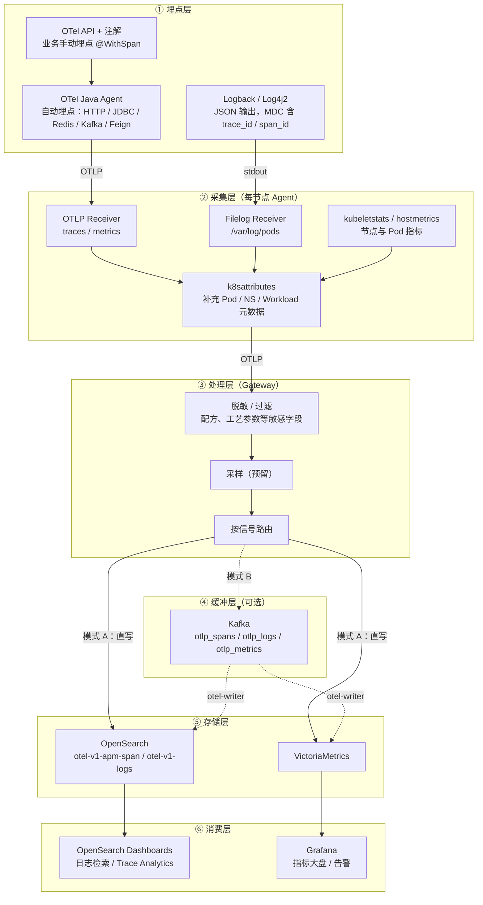
```mermaid
flowchart TB
    subgraph L1["① 埋点层"]
        api["OTel API + 注解<br/>业务手动埋点 @WithSpan"]
        ja["OTel Java Agent<br/>自动埋点：HTTP / JDBC / Redis / Kafka / Feign"]
        logfw["Logback / Log4j2<br/>JSON 输出，MDC 含 trace_id / span_id"]
    end
    subgraph L2["② 采集层（每节点 Agent）"]
        r_otlp["OTLP Receiver<br/>traces / metrics"]
        r_file["Filelog Receiver<br/>/var/log/pods"]
        r_host["kubeletstats / hostmetrics<br/>节点与 Pod 指标"]
        p_k8s["k8sattributes<br/>补充 Pod / NS / Workload 元数据"]
    end
    subgraph L3["③ 处理层（Gateway）"]
        p_red["脱敏 / 过滤<br/>配方、工艺参数等敏感字段"]
        p_samp["采样（预留）"]
        p_route["按信号路由"]
    end
    subgraph L4["④ 缓冲层（可选）"]
        kf["Kafka<br/>otlp_spans / otlp_logs / otlp_metrics"]
    end
    subgraph L5["⑤ 存储层"]
        st_os["OpenSearch<br/>otel-v1-apm-span / otel-v1-logs"]
        st_vm["VictoriaMetrics"]
    end
    subgraph L6["⑥ 消费层"]
        osd["OpenSearch Dashboards<br/>日志检索 / Trace Analytics"]
        gf["Grafana<br/>指标大盘 / 告警"]
    end

    api --> ja
    ja -- "OTLP" --> r_otlp
    logfw -- "stdout" --> r_file
    r_otlp --> p_k8s
    r_file --> p_k8s
    r_host --> p_k8s
    p_k8s -- "OTLP" --> p_red --> p_samp --> p_route
    p_route -- "模式 A：直写" --> st_os
    p_route -- "模式 A：直写" --> st_vm
    p_route -. "模式 B" .-> kf
    kf -. "otel-writer" .-> st_os
    kf -. "otel-writer" .-> st_vm
    st_os --> osd
    st_vm --> gf
```

### 3.2 信号关联模型

三类信号通过 Resource 属性和 trace_id 关联，这是排障时能互相跳转的基础。

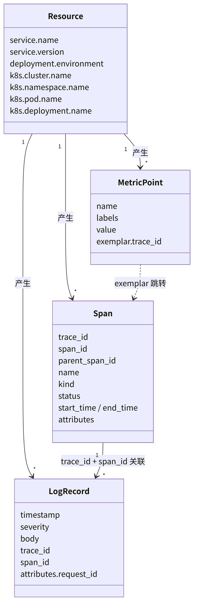

Mermaid 源码

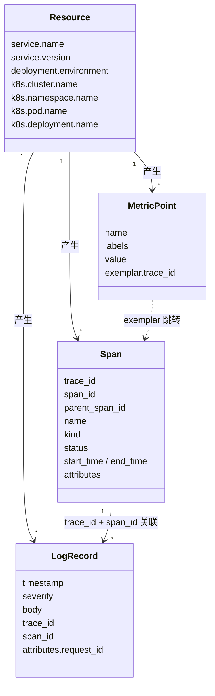
```mermaid
classDiagram
    class Resource {
        service.name
        service.version
        deployment.environment
        k8s.cluster.name
        k8s.namespace.name
        k8s.pod.name
        k8s.deployment.name
    }
    class Span {
        trace_id
        span_id
        parent_span_id
        name
        kind
        status
        start_time / end_time
        attributes
    }
    class LogRecord {
        timestamp
        severity
        body
        trace_id
        span_id
        attributes.request_id
    }
    class MetricPoint {
        name
        labels
        value
        exemplar.trace_id
    }
    Resource "1" --> "*" Span : 产生
    Resource "1" --> "*" LogRecord : 产生
    Resource "1" --> "*" MetricPoint : 产生
    Span "1" --> "*" LogRecord : trace_id + span_id 关联
    MetricPoint ..> Span : exemplar 跳转
```

### 3.3 关键字段规范

| 字段 | 来源 | 要求 |
|---|---|---|
| `service.name` | `OTEL_SERVICE_NAME` | 必填，与 Deployment 名称一致 |
| `k8s.cluster.name` | Collector resource processor | 必填，区分 1.28 / 1.35 集群 |
| `deployment.environment` | `OTEL_RESOURCE_ATTRIBUTES` | 必填：prod / uat / dev |
| `trace_id` / `span_id` | Java Agent 写入 MDC | 日志中禁止再使用业务 UUID 命名为 traceId |
| `request_id` | 业务原 UUID 改名 | 可选，保留业务语义 |

---

## 4. 进程视图（Process View）

关注运行时的进程、并发、数据流以及故障处理。

### 4.1 Agent（DaemonSet）内部流水线

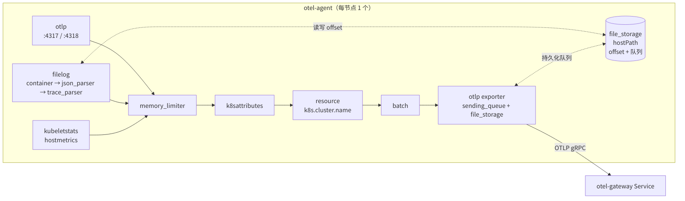

Mermaid 源码

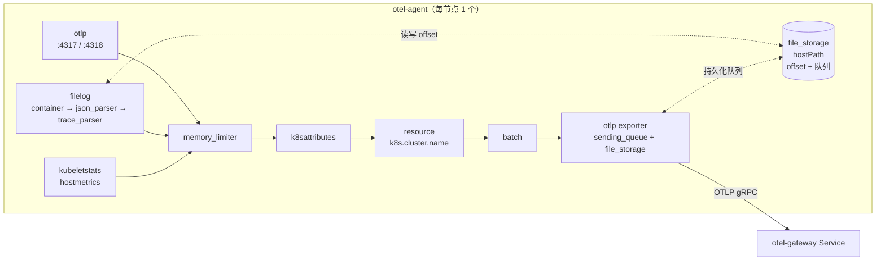
```mermaid
flowchart LR
    subgraph agent["otel-agent（每节点 1 个）"]
        direction LR
        rx1["otlp<br/>:4317 / :4318"]
        rx2["filelog<br/>container → json_parser → trace_parser"]
        rx3["kubeletstats<br/>hostmetrics"]
        ml["memory_limiter"]
        k8s["k8sattributes"]
        res["resource<br/>k8s.cluster.name"]
        bt["batch"]
        ex["otlp exporter<br/>sending_queue + file_storage"]
        fs[("file_storage<br/>hostPath<br/>offset + 队列")]

        rx1 --> ml
        rx2 --> ml
        rx3 --> ml
        ml --> k8s --> res --> bt --> ex
        rx2 <-. "读写 offset" .-> fs
        ex <-. "持久化队列" .-> fs
    end
    ex -- "OTLP gRPC" --> gw["otel-gateway Service"]
```

### 4.2 Gateway 内部流水线（模式 A / 模式 B）

Mermaid 源码

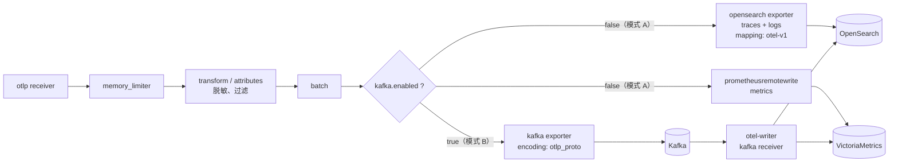
```mermaid
flowchart LR
    in["otlp receiver"] --> ml["memory_limiter"] --> tf["transform / attributes<br/>脱敏、过滤"] --> bt["batch"]

    bt --> sw{"kafka.enabled ?"}
    sw -- "false（模式 A）" --> e1["opensearch exporter<br/>traces + logs<br/>mapping: otel-v1"]
    sw -- "false（模式 A）" --> e2["prometheusremotewrite<br/>metrics"]
    sw -- "true（模式 B）" --> e3["kafka exporter<br/>encoding: otlp_proto"]

    e1 --> os[("OpenSearch")]
    e2 --> vm[("VictoriaMetrics")]
    e3 --> kf[("Kafka")]
    kf --> wr["otel-writer<br/>kafka receiver"]
    wr --> os
    wr --> vm
```

说明：图中的判断节点表示部署时的配置开关（两套 values 文件），不是运行时动态分支。

### 4.3 一次请求的 Trace 与 Log 关联时序

Mermaid 源码

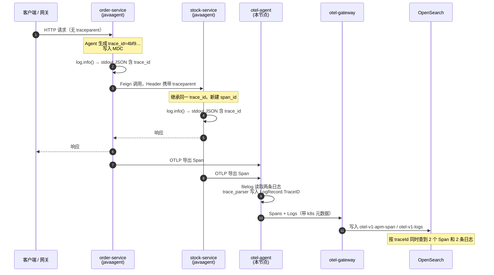
```mermaid
sequenceDiagram
    autonumber
    participant C as 客户端 / 网关
    participant A as order-service<br/>(javaagent)
    participant B as stock-service<br/>(javaagent)
    participant AG as otel-agent<br/>(本节点)
    participant GW as otel-gateway
    participant OS as OpenSearch

    C->>A: HTTP 请求（无 traceparent）
    Note over A: Agent 生成 trace_id=4bf9…<br/>写入 MDC
    A->>A: log.info() → stdout JSON 含 trace_id
    A->>B: Feign 调用，Header 携带 traceparent
    Note over B: 继承同一 trace_id，新建 span_id
    B->>B: log.info() → stdout JSON 含 trace_id
    B-->>A: 响应
    A-->>C: 响应
    A->>AG: OTLP 导出 Span
    B->>AG: OTLP 导出 Span
    AG->>AG: filelog 读取两条日志<br/>trace_parser 写入 LogRecord.TraceID
    AG->>GW: Spans + Logs（带 k8s 元数据）
    GW->>OS: 写入 otel-v1-apm-span / otel-v1-logs
    Note over OS: 按 traceId 同时查到 2 个 Span 和 2 条日志
```

### 4.4 后端故障与背压处理

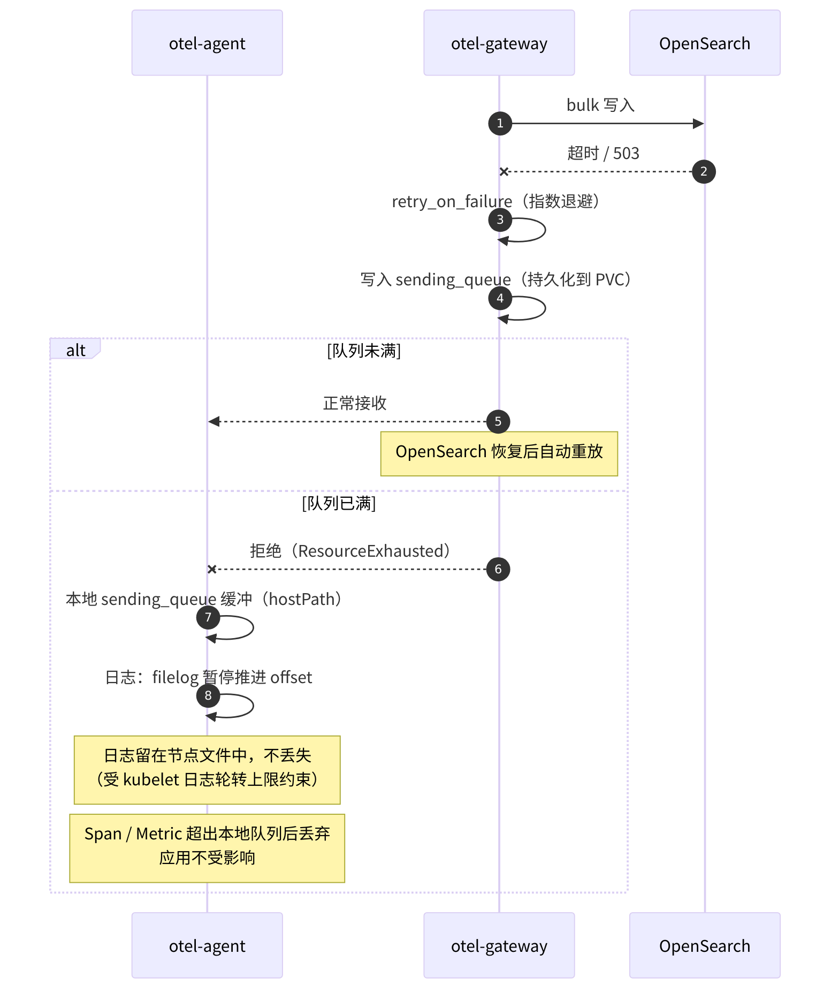

Mermaid 源码

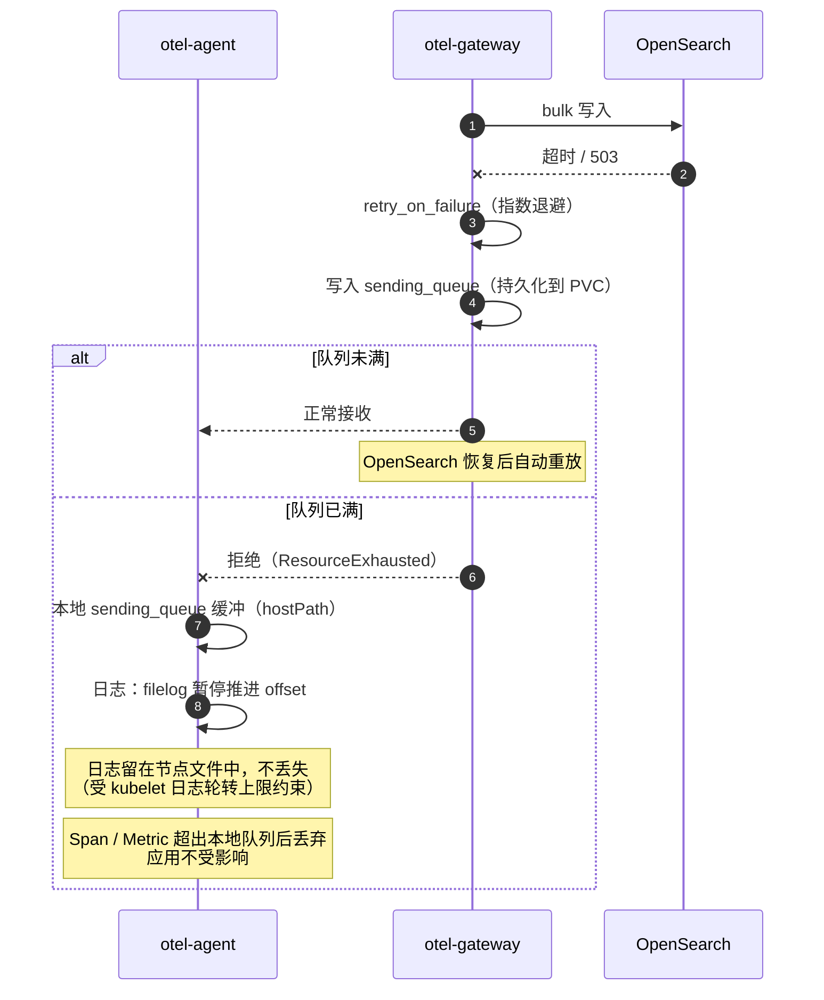
```mermaid
sequenceDiagram
    autonumber
    participant AG as otel-agent
    participant GW as otel-gateway
    participant OS as OpenSearch

    GW->>OS: bulk 写入
    OS--xGW: 超时 / 503
    GW->>GW: retry_on_failure（指数退避）
    GW->>GW: 写入 sending_queue（持久化到 PVC）
    alt 队列未满
        GW-->>AG: 正常接收
        Note over GW: OpenSearch 恢复后自动重放
    else 队列已满
        GW--xAG: 拒绝（ResourceExhausted）
        AG->>AG: 本地 sending_queue 缓冲（hostPath）
        AG->>AG: 日志：filelog 暂停推进 offset
        Note over AG: 日志留在节点文件中，不丢失<br/>（受 kubelet 日志轮转上限约束）
        Note over AG: Span / Metric 超出本地队列后丢弃<br/>应用不受影响
    end
```

### 4.5 运行时组件清单

| 组件 | 形态 | 副本 | 状态 | 关键配置 |
|---|---|---|---|---|
| otel-agent | DaemonSet | 每节点 1 | hostPath 存 offset 与队列 | `memory_limiter`、`file_storage` |
| otel-gateway | Deployment | 3 + PDB(minAvailable 2) | PVC 持久化队列 | HPA 可选 |
| otel-cluster | Deployment | 1 | 无 | `k8s_cluster`、`k8sobjects`（事件） |
| otel-writer（模式 B） | systemd 二进制，部署于后端区 | 2–3 | 无（offset 在 Kafka） | 同一 consumer group |

---

## 5. 开发视图（Development View）

关注代码、配置、制品的组织和交付方式。

### 5.1 制品与仓库结构

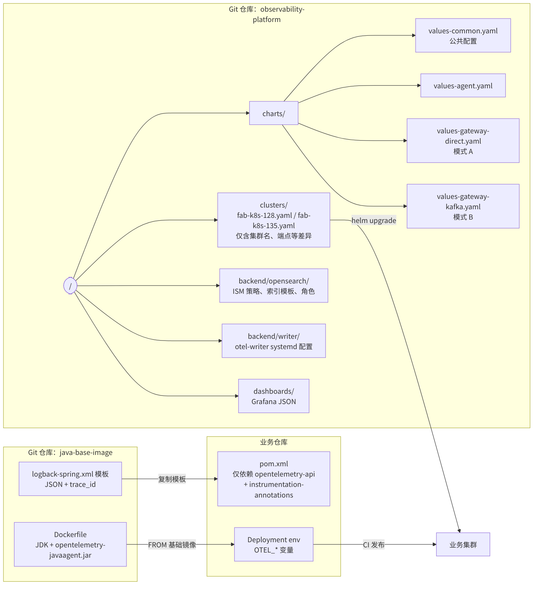

Mermaid 源码

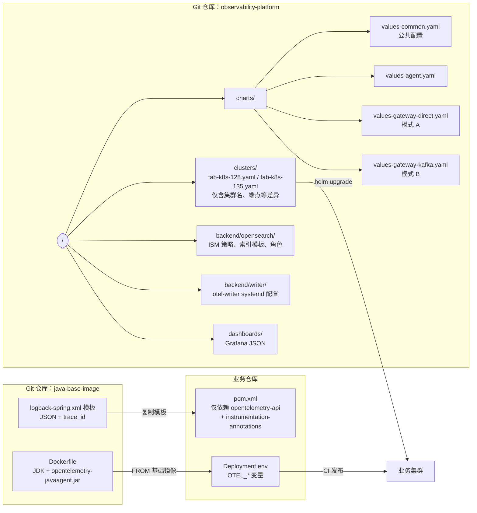
```mermaid
flowchart LR
    subgraph repo["Git 仓库：observability-platform"]
        r0(["/"])
        c0["charts/"]
        c1["values-common.yaml<br/>公共配置"]
        c2["values-agent.yaml"]
        c3["values-gateway-direct.yaml<br/>模式 A"]
        c4["values-gateway-kafka.yaml<br/>模式 B"]
        c5["clusters/<br/>fab-k8s-128.yaml / fab-k8s-135.yaml<br/>仅含集群名、端点等差异"]
        c6["backend/opensearch/<br/>ISM 策略、索引模板、角色"]
        c7["backend/writer/<br/>otel-writer systemd 配置"]
        c8["dashboards/<br/>Grafana JSON"]
        r0 --> c0
        c0 --> c1 & c2 & c3 & c4
        r0 --> c5 & c6 & c7 & c8
    end
    subgraph base["Git 仓库：java-base-image"]
        b1["Dockerfile<br/>JDK + opentelemetry-javaagent.jar"]
        b2["logback-spring.xml 模板<br/>JSON + trace_id"]
    end
    subgraph appRepo["业务仓库"]
        a1["pom.xml<br/>仅依赖 opentelemetry-api<br/>+ instrumentation-annotations"]
        a2["Deployment env<br/>OTEL_* 变量"]
    end
    k8s["业务集群"]
    b1 -- "FROM 基础镜像" --> a2
    b2 -- "复制模板" --> a1
    c5 -- "helm upgrade" --> k8s
    a2 -- "CI 发布" --> k8s
```

### 5.2 Java 应用改造规范

| 类别 | 规则 |
|---|---|
| 必须移除 | `opentelemetry-sdk*`、`opentelemetry-spring-boot-starter`（与 Agent 冲突）、Spring Cloud Sleuth、`micrometer-tracing-bridge-*` |
| 允许保留 | `opentelemetry-api`、`opentelemetry-instrumentation-annotations` |
| 日志 | 使用基础镜像提供的 `logback-spring.xml`；pattern 模式使用 `%X{trace_id}`；logstash-logback-encoder 默认输出 MDC |
| 业务 UUID | 改名为 `request_id`，不得命名为 `traceId` / `trace_id` |
| 手动埋点 | 关键业务方法使用 `@WithSpan`；属性中禁止写入配方、工艺参数、良率 |
| 配置 | 统一通过环境变量注入，禁止在代码中硬编码 Collector 地址 |

### 5.3 离线制品交付流水线

Mermaid 源码

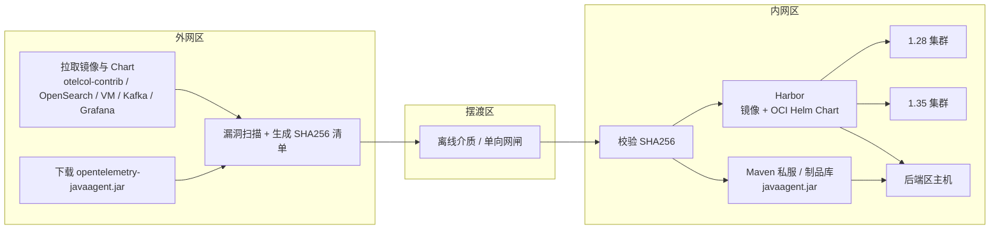
```mermaid
flowchart LR
    subgraph inet["外网区"]
        s1["拉取镜像与 Chart<br/>otelcol-contrib / OpenSearch / VM / Kafka / Grafana"]
        s2["下载 opentelemetry-javaagent.jar"]
        s3["漏洞扫描 + 生成 SHA256 清单"]
    end
    subgraph ferry["摆渡区"]
        f1["离线介质 / 单向网闸"]
    end
    subgraph intra["内网区"]
        h1["Harbor<br/>镜像 + OCI Helm Chart"]
        h2["Maven 私服 / 制品库<br/>javaagent.jar"]
        h3["校验 SHA256"]
        d1["1.28 集群"]
        d2["1.35 集群"]
        d3["后端区主机"]
    end
    s1 --> s3
    s2 --> s3
    s3 --> f1 --> h3
    h3 --> h1
    h3 --> h2
    h1 --> d1
    h1 --> d2
    h2 --> d3
    h1 --> d3
```

### 5.4 版本基线【待锁定】

| 组件 | 基线策略 |
|---|---|
| otelcol-contrib | 锁定一个具体小版本，1.28 / 1.35 使用同一版本；升级前在测试集群验证 opensearch / kafka exporter 配置字段 |
| opentelemetry-collector Helm Chart | 与 Collector 版本对应锁定 |
| OTel Java Agent | 锁定 2.x 具体版本，随基础镜像发布 |
| OpenSearch | 由 2.6 升级至当前 2.x 稳定版（独立部署） |
| VictoriaMetrics | 锁定具体版本，单机版起步 |
| Kafka | 复用现有集群或新建 KRaft 模式集群 |

---

## 6. 物理视图（Physical View）

关注部署拓扑、网络分区、主机与端口。

### 6.1 部署拓扑

Mermaid 源码

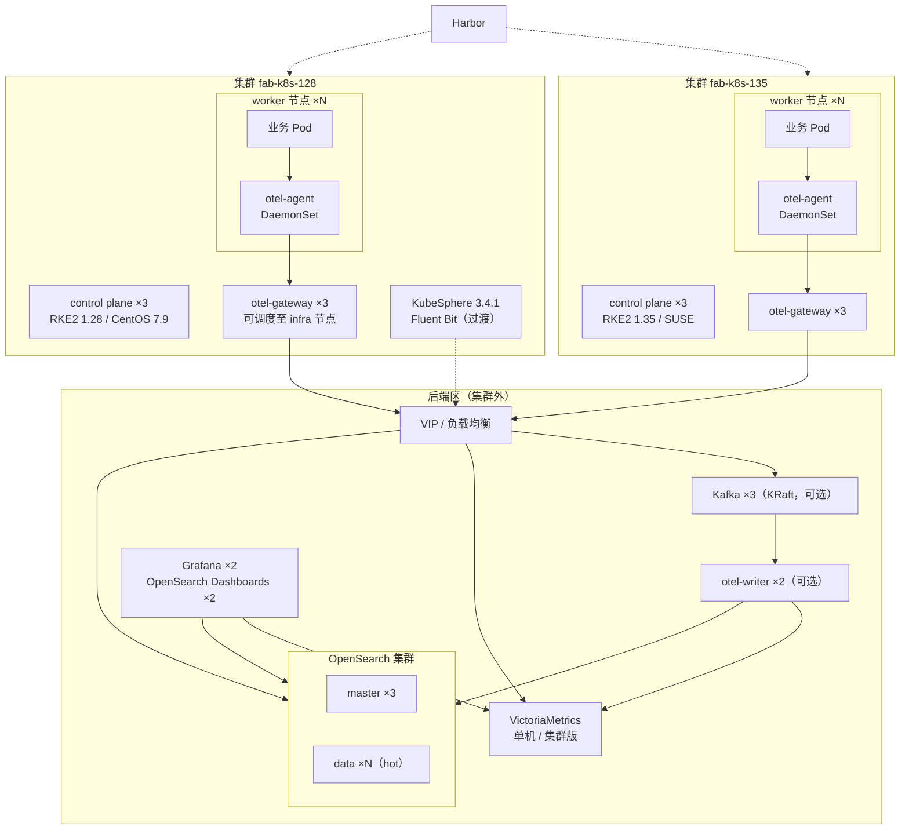
```mermaid
flowchart TB
    subgraph c135["集群 fab-k8s-135"]
        direction TB
        cp2["control plane ×3<br/>RKE2 1.35 / SUSE"]
        subgraph w2["worker 节点 ×N"]
            app2["业务 Pod"]
            ag2["otel-agent<br/>DaemonSet"]
        end
        gw2["otel-gateway ×3"]
    end
    subgraph c128["集群 fab-k8s-128"]
        direction TB
        cp1["control plane ×3<br/>RKE2 1.28 / CentOS 7.9"]
        subgraph w1["worker 节点 ×N"]
            app1["业务 Pod"]
            ag1["otel-agent<br/>DaemonSet"]
        end
        gw1["otel-gateway ×3<br/>可调度至 infra 节点"]
        ksn["KubeSphere 3.4.1<br/>Fluent Bit（过渡）"]
    end
    subgraph backend["后端区（集群外）"]
        direction TB
        subgraph osc["OpenSearch 集群"]
            osm["master ×3"]
            osd["data ×N（hot）"]
        end
        kfc["Kafka ×3（KRaft，可选）"]
        wrt["otel-writer ×2（可选）"]
        vmc["VictoriaMetrics<br/>单机 / 集群版"]
        gfa["Grafana ×2<br/>OpenSearch Dashboards ×2"]
        lb["VIP / 负载均衡"]
    end
    hb["Harbor"]

    app1 --> ag1 --> gw1
    app2 --> ag2 --> gw2
    gw1 --> lb
    gw2 --> lb
    ksn -.-> lb
    lb --> osc
    lb --> kfc
    lb --> vmc
    kfc --> wrt --> osc
    wrt --> vmc
    gfa --> osc
    gfa --> vmc
    hb -.-> c135
    hb -.-> c128
```

### 6.2 网络分区与端口

Mermaid 源码

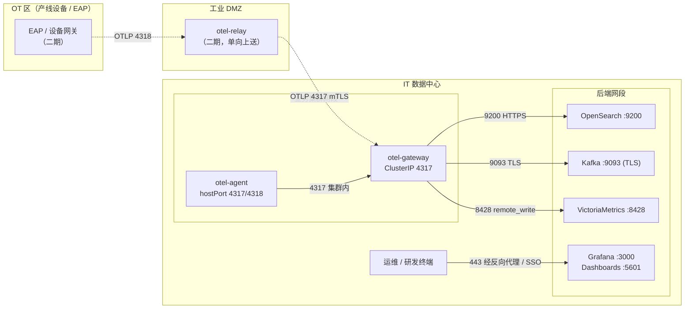
```mermaid
flowchart LR
    subgraph ot["OT 区（产线设备 / EAP）"]
        eap["EAP / 设备网关<br/>（二期）"]
    end
    subgraph dmz["工业 DMZ"]
        relay["otel-relay<br/>（二期，单向上送）"]
    end
    subgraph it["IT 数据中心"]
        subgraph k8sz["业务集群网段"]
            ag["otel-agent<br/>hostPort 4317/4318"]
            gw["otel-gateway<br/>ClusterIP 4317"]
        end
        subgraph bz["后端网段"]
            os["OpenSearch :9200"]
            kf["Kafka :9093 (TLS)"]
            vm["VictoriaMetrics :8428"]
            ui["Grafana :3000<br/>Dashboards :5601"]
        end
        ops["运维 / 研发终端"]
    end

    eap -. "OTLP 4318" .-> relay
    relay -. "OTLP 4317 mTLS" .-> gw
    ag -- "4317 集群内" --> gw
    gw -- "9200 HTTPS" --> os
    gw -- "9093 TLS" --> kf
    gw -- "8428 remote_write" --> vm
    ops -- "443 经反向代理 / SSO" --> ui
```

### 6.3 防火墙策略

| 源 | 目标 | 端口 | 协议 | 说明 |
|---|---|---|---|---|
| 业务集群节点 | OpenSearch | 9200 | HTTPS + Basic/证书 | Gateway 写入；过渡期 Fluent Bit 写入 |
| 业务集群节点 | Kafka | 9093 | TLS + SASL | 仅模式 B |
| 业务集群节点 | VictoriaMetrics | 8428 | HTTP(S) | remote_write，建议前置 vmauth 鉴权 |
| otel-writer | OpenSearch / VM | 9200 / 8428 | 同上 | 仅模式 B |
| 运维终端 | Grafana / Dashboards | 443 | HTTPS | 经反向代理，接入 LDAP / SSO |
| Pod | 本节点 otel-agent | 4317 / 4318 | OTLP | 仅集群内；NetworkPolicy 限制来源 |

安全说明：OTLP receiver 默认无鉴权。Agent 以 hostPort 暴露时，同网段任何主机都能写入，需要通过主机防火墙或 NetworkPolicy 限制为仅本节点 Pod 访问。

### 6.4 容量估算模型【待补充实际数据】

| 信号 | 估算公式 | 说明 |
|---|---|---|
| 日志 | 日均原始量 × 1.2（索引膨胀）× (1 + 副本数) × 30 天 | 先从现有 OpenSearch `_cat/indices` 统计近 7 天日均量 |
| Trace | 峰值 QPS × 每请求 Span 数 × 单 Span 约 1–2 KB × 86400 × 采样率 × (1 + 副本数) × 保留天数 | 建议 Trace 保留 7 天 |
| 指标 | 活跃时间序列数 × 采集频率 | VictoriaMetrics 单点每百万活跃序列约需数 GB 内存，按实测调整 |

---

## 7. 场景视图（+1 Scenarios）

用关键场景验证上述四个视图。

### 7.1 场景一：从指标告警定位到具体日志

Mermaid 源码

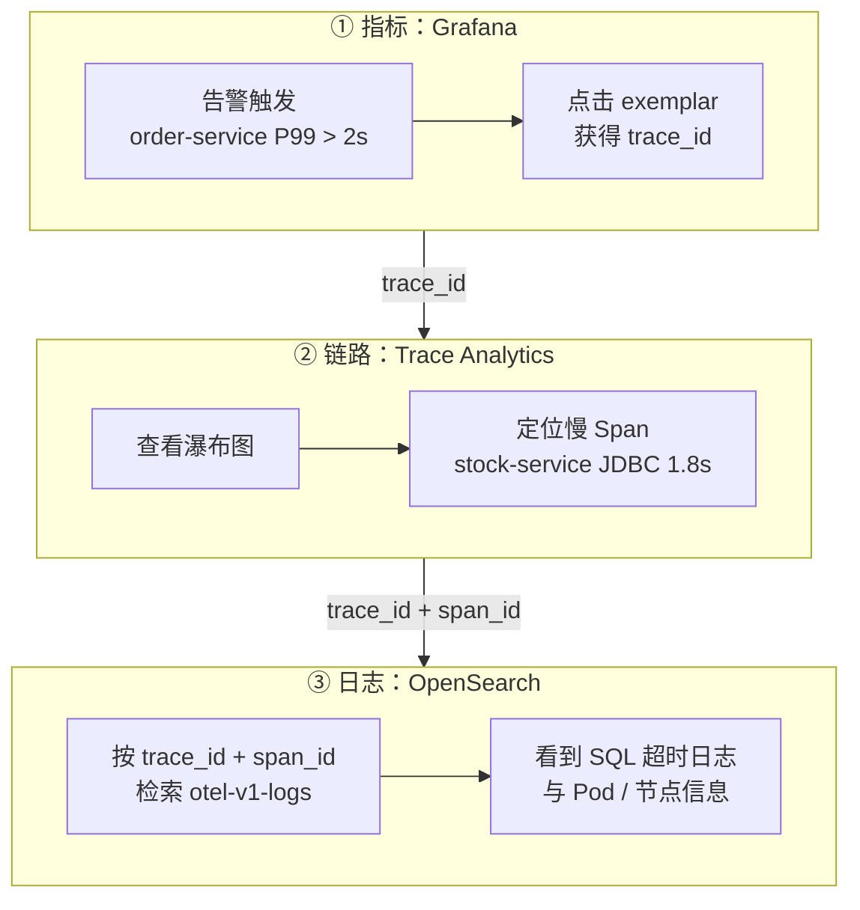
```mermaid
flowchart TB
    subgraph s1["① 指标：Grafana"]
        direction LR
        a["告警触发<br/>order-service P99 > 2s"] --> b["点击 exemplar<br/>获得 trace_id"]
    end
    subgraph s2["② 链路：Trace Analytics"]
        direction LR
        c["查看瀑布图"] --> d["定位慢 Span<br/>stock-service JDBC 1.8s"]
    end
    subgraph s3["③ 日志：OpenSearch"]
        direction LR
        e["按 trace_id + span_id<br/>检索 otel-v1-logs"] --> f["看到 SQL 超时日志<br/>与 Pod / 节点信息"]
    end
    s1 -->|trace_id| s2
    s2 -->|trace_id + span_id| s3
```

涉及视图：逻辑视图 3.2（关联模型）、进程视图 4.3（关联时序）。

### 7.2 场景二：OpenSearch 停机维护 2 小时

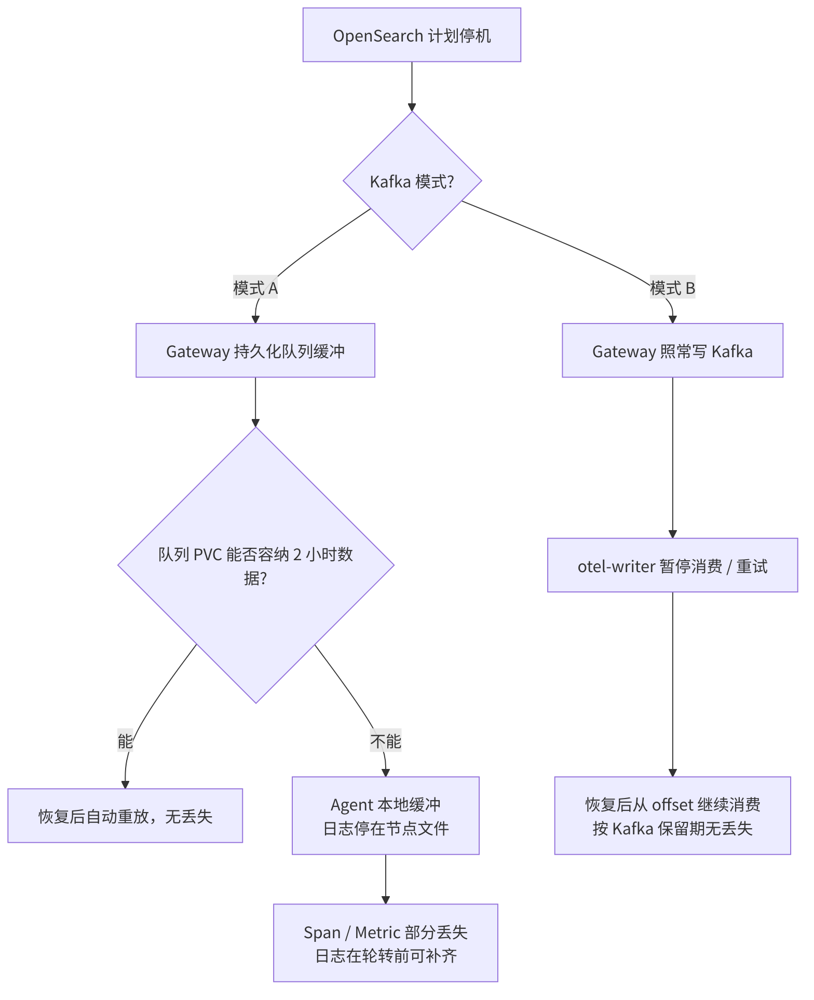

Mermaid 源码

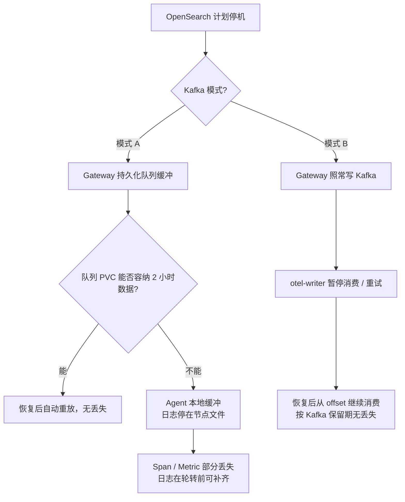
```mermaid
flowchart TB
    start["OpenSearch 计划停机"] --> q{"Kafka 模式?"}
    q -- "模式 A" --> a1["Gateway 持久化队列缓冲"]
    a1 --> a2{"队列 PVC 能否容纳 2 小时数据?"}
    a2 -- "能" --> ok1["恢复后自动重放，无丢失"]
    a2 -- "不能" --> a3["Agent 本地缓冲<br/>日志停在节点文件"]
    a3 --> a4["Span / Metric 部分丢失<br/>日志在轮转前可补齐"]
    q -- "模式 B" --> b1["Gateway 照常写 Kafka"]
    b1 --> b2["otel-writer 暂停消费 / 重试"]
    b2 --> ok2["恢复后从 offset 继续消费<br/>按 Kafka 保留期无丢失"]
```

结论：维护窗口长于 Gateway 队列可缓冲时长时，应启用模式 B。这也是 Kafka 是否启用的主要判断依据。

### 7.3 场景三：节点 drain / 重启

Mermaid 源码

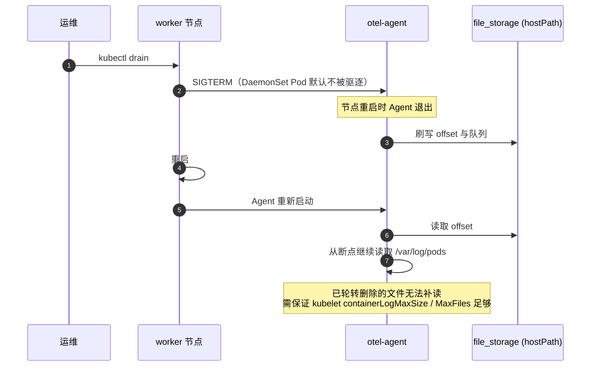
```mermaid
sequenceDiagram
    autonumber
    participant OP as 运维
    participant N as worker 节点
    participant AG as otel-agent
    participant FS as file_storage (hostPath)

    OP->>N: kubectl drain
    N->>AG: SIGTERM（DaemonSet Pod 默认不被驱逐）
    Note over AG: 节点重启时 Agent 退出
    AG->>FS: 刷写 offset 与队列
    N->>N: 重启
    N->>AG: Agent 重新启动
    AG->>FS: 读取 offset
    AG->>AG: 从断点继续读取 /var/log/pods
    Note over AG: 已轮转删除的文件无法补读<br/>需保证 kubelet containerLogMaxSize / MaxFiles 足够
```

### 7.4 场景四：业务从 1.28 迁移到 1.35

Mermaid 源码

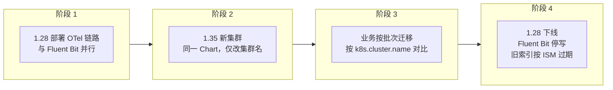
```mermaid
flowchart LR
    subgraph p1["阶段 1"]
        x1["1.28 部署 OTel 链路<br/>与 Fluent Bit 并行"]
    end
    subgraph p2["阶段 2"]
        x2["1.35 新集群<br/>同一 Chart，仅改集群名"]
    end
    subgraph p3["阶段 3"]
        x3["业务按批次迁移<br/>按 k8s.cluster.name 对比"]
    end
    subgraph p4["阶段 4"]
        x4["1.28 下线<br/>Fluent Bit 停写<br/>旧索引按 ISM 过期"]
    end
    p1 --> p2 --> p3 --> p4
```

迁移期间，同一服务在两个集群的数据写入相同索引，通过 `k8s.cluster.name` 区分，查询与大盘无需修改。

### 7.5 场景五：Kafka 模式切换

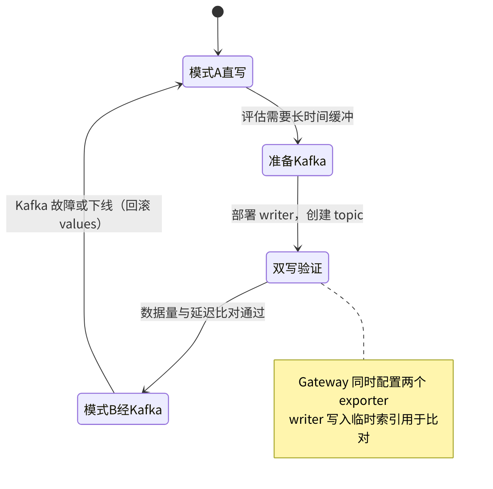

Mermaid 源码

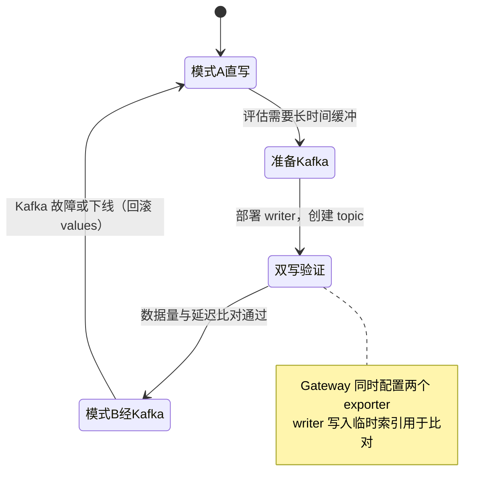
```mermaid
stateDiagram-v2
    [*] --> 模式A直写
    模式A直写 --> 准备Kafka : 评估需要长时间缓冲
    准备Kafka --> 双写验证 : 部署 writer，创建 topic
    双写验证 --> 模式B经Kafka : 数据量与延迟比对通过
    模式B经Kafka --> 模式A直写 : Kafka 故障或下线（回滚 values）
    note right of 双写验证
        Gateway 同时配置两个 exporter
        writer 写入临时索引用于比对
    end note
```

---

## 8. 数据生命周期

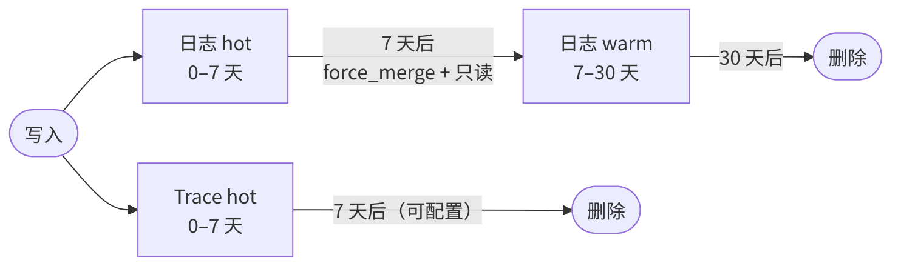

Mermaid 源码

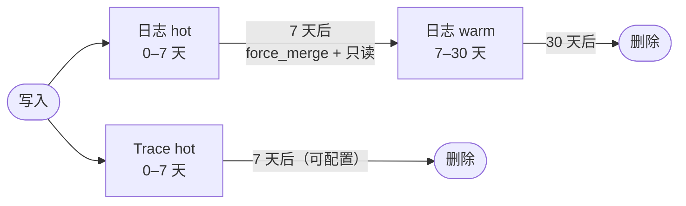
```mermaid
flowchart LR
    w([写入]) --> lh["日志 hot<br/>0–7 天"]
    lh -->|"7 天后<br/>force_merge + 只读"| lw["日志 warm<br/>7–30 天"]
    lw -->|30 天后| d1([删除])
    w --> th["Trace hot<br/>0–7 天"]
    th -->|"7 天后（可配置）"| d2([删除])
```

| 数据 | 索引 | 保留 | 策略 |
|---|---|---|---|
| 应用日志 | `otel-v1-logs-*` | 30 天 | ISM：rollover（按大小或天）→ 7 天 warm → 30 天删除 |
| Trace | `otel-v1-apm-span-*` | 7 天【待确认】 | ISM：rollover → 7 天删除 |
| 指标 | VictoriaMetrics | 30–90 天 | `-retentionPeriod` 参数 |
| 旧日志（Fluent Bit） | 现有索引 | 30 天自然过期 | 迁移完成后不再写入 |

---

## 9. 非功能设计

| 维度 | 设计 |
|---|---|
| 可用性 | Gateway 3 副本 + PDB；OpenSearch 3 master；后端组件跨机架/宿主机分布 |
| 业务隔离 | Agent 设置 CPU/内存 limit 与 `memory_limiter`；javaagent 导出为异步，失败不阻塞业务线程 |
| 数据可靠性 | 日志靠节点文件 + offset 持久化；Span/Metric 靠多级持久化队列；可选 Kafka |
| 安全 | Collector → 后端全链路 TLS；OpenSearch 启用 security 插件，按 BU / 产线划分租户与索引权限；Gateway 统一脱敏 |
| 合规 | 配方、工艺参数、良率等字段列入黑名单，在 Gateway `transform` / `attributes` 处理器中删除或哈希 |
| 自监控 | 所有 Collector 暴露 `:8888` 内部指标，重点监控 `otelcol_exporter_send_failed_*`、`otelcol_exporter_queue_size`、`otelcol_processor_refused_*` |
| 时钟 | 全部节点与后端主机统一 NTP 源，偏差 < 100ms |

---

## 10. 实施路线

Mermaid 源码

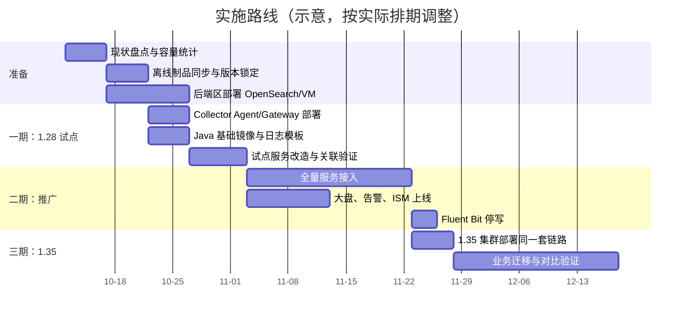
```mermaid
gantt
    title 实施路线（示意，按实际排期调整）
    dateFormat YYYY-MM-DD
    axisFormat %m-%d
    todayMarker off
    section 准备
    现状盘点与容量统计          :a1, 2026-10-12, 5d
    离线制品同步与版本锁定      :a2, after a1, 5d
    后端区部署 OpenSearch/VM    :a3, after a1, 10d
    section 一期：1.28 试点
    Collector Agent/Gateway 部署 :b1, after a2, 5d
    Java 基础镜像与日志模板      :b2, after a2, 5d
    试点服务改造与关联验证       :b3, after b1, 7d
    section 二期：推广
    全量服务接入                 :c1, after b3, 20d
    大盘、告警、ISM 上线         :c2, after b3, 10d
    Fluent Bit 停写              :c3, after c1, 3d
    section 三期：1.35
    1.35 集群部署同一套链路      :d1, after c1, 5d
    业务迁移与对比验证           :d2, after d1, 20d
```

### 10.1 验收标准

| 编号 | 标准 |
|---|---|
| AC-1 | 任意一条业务日志中的 trace_id，可在 OpenSearch 中查到对应 Span，反之亦然 |
| AC-2 | 跨服务调用（HTTP / Feign / MQ）链路完整，无断链 |
| AC-3 | 重启任一 Gateway 副本或任一节点，日志无丢失（以序号日志验证） |
| AC-4 | OpenSearch 停机 30 分钟，恢复后数据自动补齐（模式 A）|
| AC-5 | 1.28 与 1.35 使用同一份 Chart 与 values，仅集群差异文件不同 |
| AC-6 | 关闭全部 Collector，业务接口延迟无明显变化 |

---

## 11. 风险与应对

| 风险 | 影响 | 应对 |
|---|---|---|
| KubeSphere 3.4 在 1.28 / 1.35 上的兼容性 | 平台功能异常 | 新链路不依赖 KubeSphere；1.35 评估 KubeSphere 4.x 或不再使用 |
| OpenSearch exporter 为 alpha 阶段 | 配置字段变更、行为差异 | 锁定版本；升级前回归测试；备选 Data Prepper |
| CentOS 7.9 为 cgroup v1，且已停止维护 | 1.35 kubelet 默认拒绝 cgroup v1 | 1.35 仅使用 SUSE 节点并确认 cgroup v2 |
| RKE2 自带 containerd | containerd 版本随 RKE2 版本变化 | 不单独升级 containerd，跟随 RKE2 发行版 |
| 业务残留 Sleuth / 手动 SDK | trace_id 仍不一致 | 制定依赖黑名单，CI 中用 `mvn dependency:tree` 检查 |
| 日志轮转快于 Collector 恢复 | 故障期间日志丢失 | 调大 kubelet `containerLogMaxSize` / `containerLogMaxFiles`；监控 Agent 延迟 |
| 敏感工艺数据进入可观测系统 | 合规风险 | Gateway 统一脱敏；Span 属性白名单评审 |
| 索引数量膨胀 | OpenSearch 不稳定 | 禁止以高基数字段做动态索引名；按信号 + 日期滚动 |

---

## 12. 待确认事项

| 编号 | 事项 | 影响章节 |
|---|---|---|
| Q1 | Spring Boot / JDK 版本；是否存在 Sleuth 或 micrometer-tracing 依赖 | 5.2 |
| Q2 | 日志框架（Logback / Log4j2）与 JSON 编码器；提供一行样例日志 | 3.3、4.1 |
| Q3 | OpenSearch 2.6 是 KubeSphere 集群内部署还是独立部署 | 6.1、10 |
| Q4 | 指标后端选择 VictoriaMetrics 还是 Prometheus | ADR-05 |
| Q5 | 服务间是否有 MQ / 网关（Spring Cloud Gateway、ingress-nginx、RocketMQ 等） | 4.3、AC-2 |
| Q6 | 日志日均量、峰值 QPS、Trace 保留天数 | 6.4、8 |
| Q7 | 现有 Kafka 版本、是否可复用 | ADR-07 |
| Q8 | SUSE 节点的具体发行版本及 cgroup 版本 | 11 |
